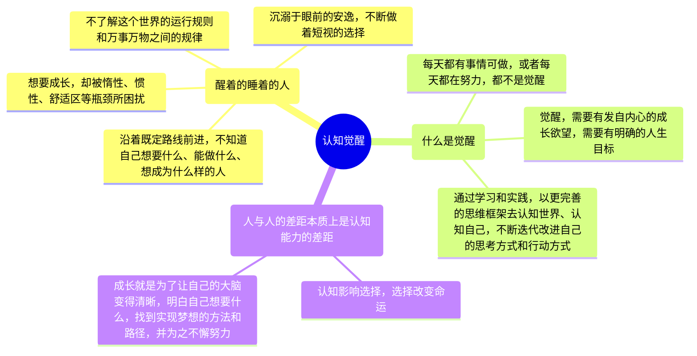
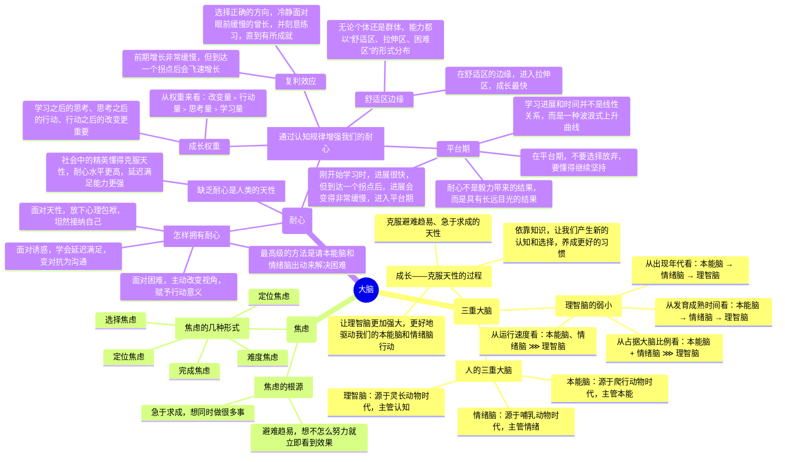

# 周岭《认知觉醒：改变自我的原动力》阅读笔记

## “醒着的睡着的人”

我们每个人一生下来的时候认知都是混沌的，人生观、价值观、世界观都是从零开始的。许多人天生追求一种简单、舒适、轻松的生活方式，被这样的天性支配着，身陷其中而不自知。

我们很多人都活在一个“**醒着的睡着的人**”这样的状态里。许多人都沿着求学—工作—婚恋这样的既定路线前进，不断适应社会的规则，应对生活的烦恼，随波逐流，不断做着短视的选择，沉溺于安逸之中，不了解这个世界的运行规则和万事万物之间的规律，不知道自己想要什么、能做什么、想成为什么样的人。

而一小部分的人意识到了这样的困局，跳出了成长的陷阱，刻意逼迫提升自己。然而他们在成长的过程中也遇到了不少瓶颈——想努力，却被惰性所困；想改变，却被惯性所束缚；想成长，却被舒适区所困扰。

那么我们如何成为一个努力成长、高效提升的人呢？我们需要做的事情，总结为四个字，就是“**认知觉醒**”。什么是觉醒呢？每天忙忙碌碌有事情做，这不是觉醒；每天都努力地把手头的事情做完，这也不是觉醒。真正的觉醒，就是要有一种发自内心的成长欲望，给自己制定明确的人生目标，并通过学习和实践，以更完善的思维框架去认知世界、认知自己，不断迭代改进自己的思考方式和行动方式，最终接近并达成自己的人生目标。

<b>人与人的差距本质上是认知能力的差距。</b>认知影响选择，选择改变命运。成长就是为了让自己的大脑变得清晰，明白自己想要什么，找到实现梦想的方法和路径，并为之不懈努力。

## 大脑

### 三重大脑

人的大脑可以分为三个部分：**本能脑**、**情绪脑**、**理智脑**。

* **本能脑**：源于爬行动物时代，主管本能
* **情绪脑**：源于哺乳动物时代，主管情绪
* **理智脑**：源于灵长动物时代，主管认知

理智脑是人类独有的。它让我们产生了语言、创造艺术、发展科技、建立文明的能力，使得人类在地球上占据了独立的生存优势。

然而，我们的理智脑相比本能脑、情绪脑实在是太弱小了。主要是由四个原因造成的：

1. 从发展历史看，本能脑发展历史最早，情绪脑次之，而理智脑的发展历史远远晚于前两者；
2. 从发育阶段看，一个人的本能脑在婴儿时期就基本发育完成了，情绪脑则是在青春期发育完成，而理智脑要到成年早期才能发育成熟；
3. 从大脑组成看，本能脑和情绪脑在大脑中占据的神经元细胞达到近八成，远远多于理智脑的占比；
4. 从运行速度看，四是本能脑和情绪脑掌握着潜意识和生理系统，运行速度极快；而理智脑运行速度慢，并且非常耗能。

由于本能脑和情绪脑一直被生存压力塑造着，因此养成了**目光短浅、即时满足**的天性，又因为它们对人的大脑决策强大的支配地位，所以人们**大部分的决策往往源于本能和情绪，而非理智**。大脑的这种构造也是人类形成**避难趋易、急于求成**的天性的根源，使得我们总是陷入“**明明知道，但就是做不到；特别想要，但就是得不到**”的怪圈。很多时候我们以为自己在思考，其实那只是在为自己的行为和欲望进行合理化的解释。

成长，就是要克服我们这种**避难趋易、急于求成**的天性，让自己的理智脑变得更加强大，让自己的大脑变得更加清晰，让自己的思考更加理性，让自己的行动更加高效。因此，我们需要养成经常思考、时常反思的习惯，让自己的理性思维占据思维的主导，养成良好的思考习惯。

<b>习惯之所以难以改变，就是因为习惯是自我巩固的——越用越强，越强越用。</b>要想从既有的习惯中跳出来，靠自制力是不够的，我们需要依靠知识，让知识帮助我们产生新的认知和选择。

但是，这并不意味着要抹杀我们的本能脑和情绪脑，事实上也抹杀不了。我们需要做的是，让理智脑成为大脑的主导，让本能脑和情绪脑成为理智脑的助手，让它们为我们服务，而不是让它们主宰我们。

### 焦虑

由于**避难趋易、急于求成**的天性，我们经常会陷入焦虑之中。焦虑的根源主要有两个：
1. 急于求成，想同时做很多事；
2. 避难趋易，想不怎么努力就立即看到效果。

常见的焦虑形式有：

1. 完成焦虑
2. 定位焦虑
3. 选择焦虑
4. 环境焦虑
5. 难度焦虑

### 耐心

由于本能脑和情绪脑强大的支配地位，使人们形成了**避难趋易、急于求成**的天性，这种天性使得我们缺乏耐心，缺乏长远的目光，缺乏坚持的毅力，缺乏克服困难的勇气。

我们可以通过学习一些认知规律，来增强我们的耐心：

1. **复利效应**：前期增长非常缓慢，但到达一个拐点后会飞速增长。选择正确的方向，冷静面对眼前缓慢的增长，并刻意练习，直到有所成就。
2. **舒适区—拉伸区—困难区**：无论个体还是群体，能力都以“舒适区、拉伸区、困难区”的形式分布。在舒适区的边缘，进入拉伸区，成长最快。
3. **成长权重**：学习不是目的，而是手段。学习之后的思考、思考之后的行动、行动之后的改变更重要。从权重来看：**改变量﹥行动量﹥思考量﹥学习量**。
4. **平台期**：我们的学习进展和时间的投入并不是线性关系。刚开始学习时，进展很快，但到达一个拐点后，进展会变得非常缓慢，进入平台期。在平台期，不要选择放弃，要懂得继续坚持。耐心不是毅力带来的结果，而是具有长远目光的结果。

那么怎样拥有耐心呢？我们可以从以下几个方面着手：

1. 面对天性，放下心理包袱，坦然接纳自己。
2. 面对诱惑，学会延迟满足，变对抗为沟通。
3. 面对困难，主动改变视角，赋予行动意义。
4. 最高级的办法——请本能脑和情绪脑出动来解决困难。

