# 周岭《认知觉醒：改变自我的原动力》阅读笔记

## 自序 开启自我改变的原动力

我们每个人一生下来的时候认知都是混沌的，人生观、价值观、世界观都是从零开始的。许多人天生追求一种简单、舒适、轻松的生活方式，被这样的天性支配着，身陷其中而不自知。

我们很多人都活在一个“**醒着的睡着的人**”这样的状态里。许多人都沿着求学—工作—婚恋这样的既定路线前进，不断适应社会的规则，应对生活的烦恼，随波逐流，不断做着短视的选择，沉溺于安逸之中，不了解这个世界的运行规则和万事万物之间的规律，不知道自己想要什么、能做什么、想成为什么样的人。

而一小部分的人意识到了这样的困局，跳出了成长的陷阱，刻意逼迫提升自己。然而他们在成长的过程中也遇到了不少瓶颈——想努力，却被惰性所困；想改变，却被惯性所束缚；想成长，却被舒适区所困扰。

那么我们如何成为一个努力成长、高效提升的人呢？我们需要做的事情，总结为四个字，就是“**认知觉醒**”。什么是觉醒呢？每天忙忙碌碌有事情做，这不是觉醒；每天都努力地把手头的事情做完，这也不是觉醒。真正的觉醒，就是要有一种发自内心的成长欲望，给自己制定明确的人生目标，并通过学习和实践，以更完善的思维框架去认知世界、认知自己，不断迭代改进自己的思考方式和行动方式，最终接近并达成自己的人生目标。

<b>人与人的差距本质上是认知能力的差距。</b>认知影响选择，选择改变命运。成长就是为了让自己的大脑变得清晰，明白自己想要什么，找到实现梦想的方法和路径，并为之不懈努力。

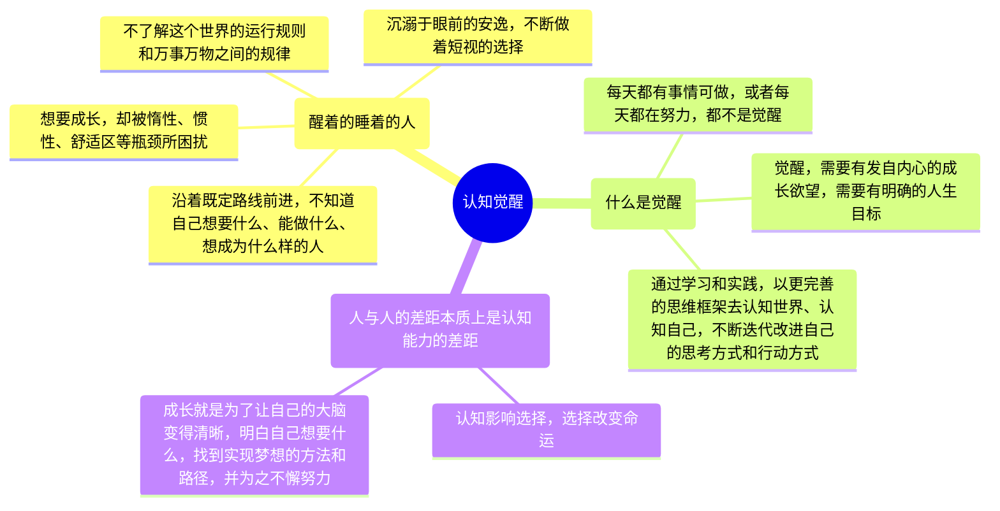

## 上篇 内观自己，摆脱焦虑

### 第一章 大脑——一切问题的根源

#### 三重大脑

人的大脑可以分为三个部分：**本能脑**、**情绪脑**、**理智脑**。

* **本能脑**：源于爬行动物时代，主管本能
* **情绪脑**：源于哺乳动物时代，主管情绪
* **理智脑**：源于灵长动物时代，主管认知

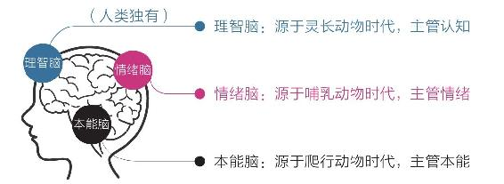

理智脑是人类独有的。它让我们产生了语言、创造艺术、发展科技、建立文明的能力，使得人类在地球上占据了独立的生存优势。

然而，我们的理智脑相比本能脑、情绪脑实在是太弱小了。主要是由四个原因造成的：

1. 从发展历史看，本能脑发展历史最早，情绪脑次之，而理智脑的发展历史远远晚于前两者；
2. 从发育阶段看，一个人的本能脑在婴儿时期就基本发育完成了，情绪脑则是在青春期发育完成，而理智脑要到成年早期才能发育成熟；
3. 从大脑组成看，本能脑和情绪脑在大脑中占据的神经元细胞达到近八成，远远多于理智脑的占比；
4. 从运行速度看，四是本能脑和情绪脑掌握着潜意识和生理系统，运行速度极快；而理智脑运行速度慢，并且非常耗能。

 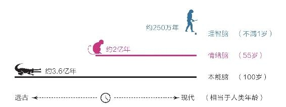

由于本能脑和情绪脑一直被生存压力塑造着，因此养成了**目光短浅、即时满足**的天性，又因为它们对人的大脑决策强大的支配地位，所以人们**大部分的决策往往源于本能和情绪，而非理智**。大脑的这种构造也是人类形成**避难趋易、急于求成**的天性的根源，使得我们总是陷入“**明明知道，但就是做不到；特别想要，但就是得不到**”的怪圈。很多时候我们以为自己在思考，其实那只是在为自己的行为和欲望进行合理化的解释。

成长，就是要克服我们这种**避难趋易、急于求成**的天性，让自己的理智脑变得更加强大，让自己的大脑变得更加清晰，让自己的思考更加理性，让自己的行动更加高效。因此，我们需要养成经常思考、时常反思的习惯，让自己的理性思维占据思维的主导，养成良好的思考习惯。

<b>习惯之所以难以改变，就是因为习惯是自我巩固的——越用越强，越强越用。</b>要想从既有的习惯中跳出来，靠自制力是不够的，我们需要依靠知识，让知识帮助我们产生新的认知和选择。

但是，这并不意味着要抹杀我们的本能脑和情绪脑，事实上也抹杀不了。我们需要做的是，让理智脑成为大脑的主导，让本能脑和情绪脑成为理智脑的助手，让它们为我们服务，而不是让它们主宰我们。

#### 焦虑

由于**避难趋易、急于求成**的天性，我们经常会陷入焦虑之中。焦虑的根源主要有两个：

1. 急于求成，想同时做很多事；
2. 避难趋易，想不怎么努力就立即看到效果。

常见的焦虑形式有：

1. 完成焦虑
2. 定位焦虑
3. 选择焦虑
4. 环境焦虑
5. 难度焦虑

#### 耐心

由于本能脑和情绪脑强大的支配地位，使人们形成了**避难趋易、急于求成**的天性，这种天性使得我们缺乏耐心，缺乏长远的目光，缺乏坚持的毅力，缺乏克服困难的勇气。

我们可以通过学习一些认知规律，来增强我们的耐心：

1. **复利效应**：前期增长非常缓慢，但到达一个拐点后会飞速增长。选择正确的方向，冷静面对眼前缓慢的增长，并刻意练习，直到有所成就。
2. **舒适区—拉伸区—困难区**：无论个体还是群体，能力都以“舒适区、拉伸区、困难区”的形式分布。在舒适区的边缘，进入拉伸区，成长最快。
3. **成长权重**：学习不是目的，而是手段。学习之后的思考、思考之后的行动、行动之后的改变更重要。从权重来看：**改变量﹥行动量﹥思考量﹥学习量**。
4. **平台期**：我们的学习进展和时间的投入并不是线性关系。刚开始学习时，进展很快，但到达一个拐点后，进展会变得非常缓慢，进入平台期。在平台期，不要选择放弃，要懂得继续坚持。耐心不是毅力带来的结果，而是具有长远目光的结果。

<table>
    <caption>认知规律</caption>
    <tbody>
        <tr>
            <td>
                <figure>
                    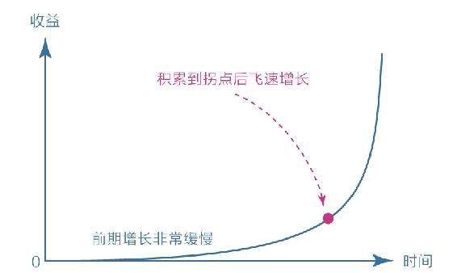
                    <figcaption>复利曲线</figcaption>
                </figure>
            </td>
            <td>
                <figure>
                    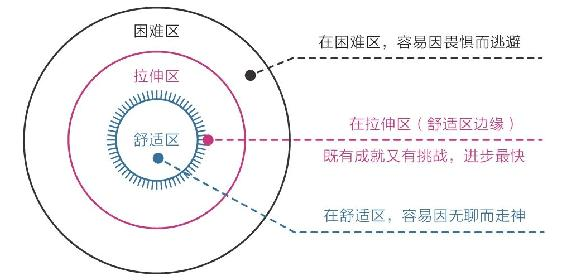
                    <figcaption>在舒适区边缘扩展自己的行动范围</figcaption>
                </figure>
            </td>
        </tr>
        <tr>
            <td>
                <figure>
                    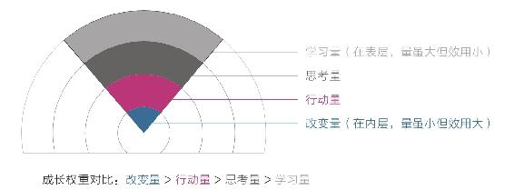
                    <figcaption>成长权重对比</figcaption>
                </figure>
            </td>
            <td>
                <figure>
                    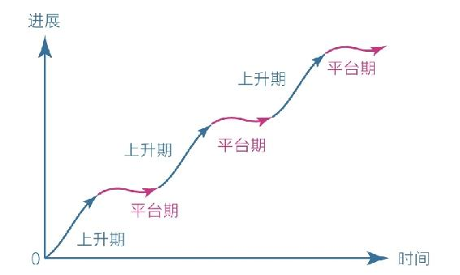
                    <figcaption>学习曲线</figcaption>
                </figure>
            </td>
        </tr>
    </tbody>
</table>

那么怎样拥有耐心呢？我们可以从以下几个方面着手：

1. 面对天性，放下心理包袱，坦然接纳自己。
2. 面对诱惑，学会延迟满足，变对抗为沟通。
3. 面对困难，主动改变视角，赋予行动意义。
4. 最高级的办法——请本能脑和情绪脑出动来解决困难。

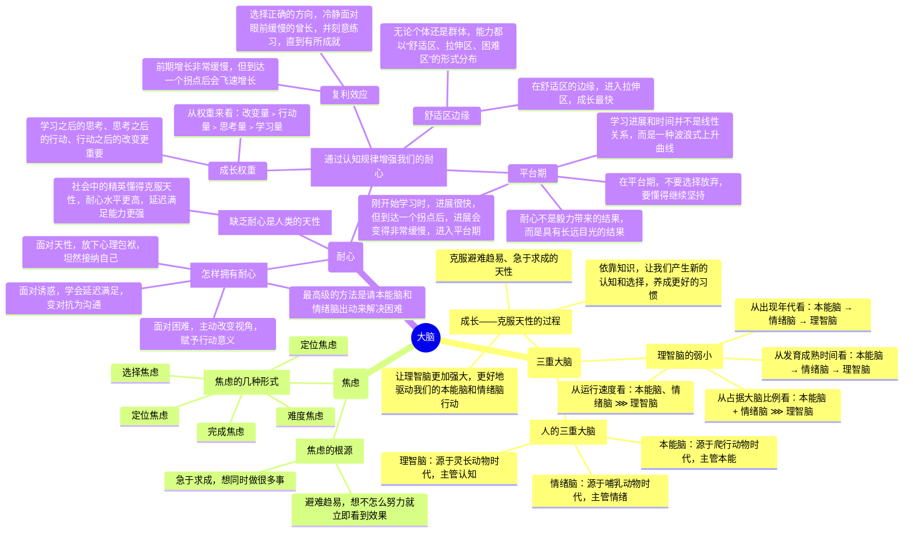

### 第二章 潜意识——生命留给我们的彩蛋

#### 模糊

我们的大脑是一个非常复杂的系统，它的运行方式可以分为两种：**意识**和**潜意识**。这是进化带来的结果，通过意识分层的方式，让两者分工协作，提高大脑的运行效率。

然而，进化是一把双刃剑，意识分层也给大脑带来了副作用——**模糊**。由于意识和潜意识处理信息的速度不对等，意识很难介入潜意识，潜意识却能轻易左右意识。这也是人们经常做出一些不理解的事情、不理性的决策的原因。

模糊是人生的困扰之源，谁的模糊越多，谁就越混沌；谁的模糊越少，谁就越清醒。所以我们就需要通过认知提升来消除模糊，可以通过以下几种方式：

1. **学习知识，消除情绪模糊**：通过学习知识、提升思考能力，让自己的思维更加清晰，消除思维模糊。
2. **拆解烦恼，消除情绪模糊**：真正的困难总是比人们内心想的要小很多，人们拖延、纠结、位居、害怕的原因正是内心想法模糊，所以我们需要正视困难、看清困难、拆解困难、消除困难，不给困难和痛苦进入潜意识的机会，把它们从潜意识里面挖出来，把它们看得清清楚楚，从而消除情绪模糊。
3. **里清外明，消除行动模糊**：行动力不足的原因是选择模糊，因此我们需要有足够清晰的指令或目标引导自己行动，耗费更多的脑力和心力去思考自己的目标，把目标过程细化、具体化，从而消除行动模糊。

#### 感性

潜意识没有思维，只关心眼前的事物，喜欢**即刻、确定、简单、舒适**，这是属于**天性的部分**，同时，它处理信息的速度又极快，能敏锐地捕捉到很多不易察觉的信息；而我们的理性思考，处理信息能力就相形见绌了。所以很多人在做选择和决策的时候，经常会捕捉到潜意识发出的微弱信号，也就是<b>“凭感觉”——察觉潜意识发出的信息</b>。

我们利用潜意识的一些方式：

* **凭感觉学习**：先用感性能力帮助自己选择，再用理性能力帮助自己思考，这样不仅收获更大，而且也不会焦虑。
* **凭感觉寻找人生目标**：目标是我们存放热情和精力的地方，用感知力代替思考力，先用感性选择，再用理性思考，或许是一个更好的策略，尤其是在做那些重大选择时。

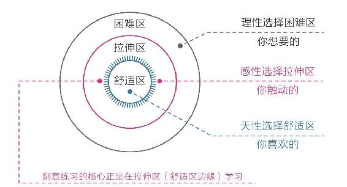

那么我们如何捕捉感性呢？我们可以通过以下几种方式：

1. **“最”字法**：关注最触动自己的点，捕捉它们。
2. **“总”字法**：关注脑海中总是不自觉冒出来的某些念头，或是心里总是挥之不去的事，审视并消除它们。
3. **无意识的第一反应**：关注自己第一次见某个人或者做某件事的反应，第一个年头往往是潜意识发出的真实信息。
4. **梦境**：梦境可能是内心的真实想法，也可能是灵感的启发。
5. **身体**：身体不会说话，却是最诚实的，因此我们需要关注生理或者心理上的不适反应。
6. **直觉**：给一些来路不明、无法解释的信息开绿灯。

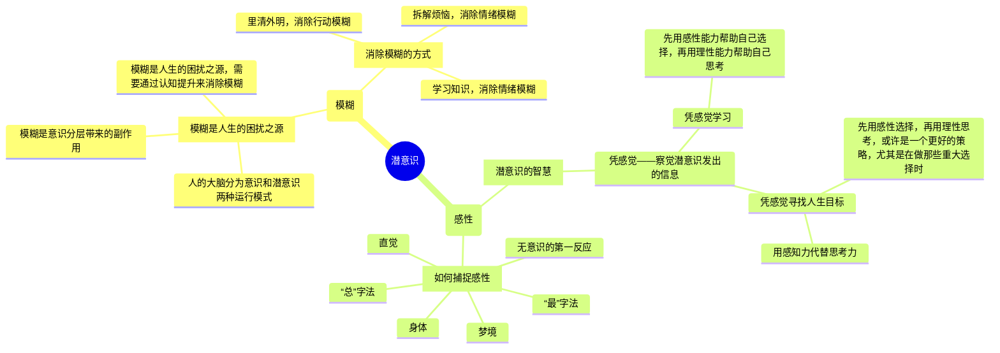

### 第三章 元认知——人类的终极能力

#### 元认知

**元认知**是人类的终极能力，它能让人**对自身的思考过程进行认知、理解和反思**。这是我们人类独有的能力，也是我们人类成为万物之灵的根源。这使得人类可以依靠理性与智慧生活，而其他动物只能依靠本能与情绪来生存。不仅如此，人类还可以通过观察自己的思维活动，找出其中不合理的地方，不断改进优化，做出更合理的选择。

虽然人人都有反思能力，但是人与人差异如此之大，核心原因就是**元认知能力的差异**，**拥有更高级的元认知能力，就能做出更好的选择，从而获得更好的结果**。

元认知可以分为两类：**被动元认知**和**主动元认知**。普通人只有在遇到问题的时候才被迫其用这个能力，处于顺境时则以就按照本能生活。而拥有更高级的元认知能力的人，会主动地运用这个能力，不断地反思自己的思考过程，意识到自己在想什么，意识到这些想法是否明知，进而去纠正那些不明智的想法，最终做出不一样的选择。当一个人能开始主动运用第三视角来观察自己、持续反思自己的思维和行为时，就有了快速成长的可能。

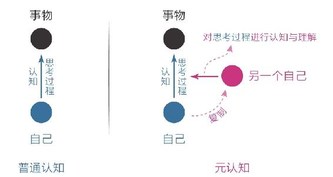

元认知的维度可分为：

* 高度（全局视角）
* 深度（底层规律）
* 过去（认知规律）
* 未来（未来视角）

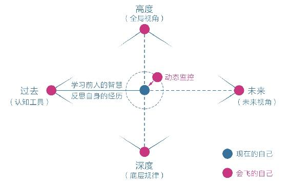

获取元认知的能力，有一些系统的方法：

1. 从“过去”端获取，学习前人的智慧、反思自身的经历。
2. 反思复盘自身的经历，总结经验教训，汲取生活中的智慧。
3. 动态监控自己的思维和行为，一旦有不合理的行为，及时发现，及时纠正。
4. 冥想，静下心来，放松身体，监控自己的注意力，集中到自己需要关注的地方。

想掌握元认知的能力并不容易，需要我们不断练习、练习、再练习。通过反复不断的练习，我们可以逐渐掌握这个能力，从而成为一个和以前不一样的自己。

#### 自控力

**元认知能力是觉察力和自控力的组合**，从实用角度讲，它可以被重新定义为：**自我审视、主动控制，防止被潜意识左右的能力**。

我们天然被潜意识左右，经常因为外界各种各样的信息而分心，而没有发挥自我审视、主动控制的能力。成长就是为了**主动控制，让理智脑的战斗力慢慢增强**。每当需要做出选择的时候，我们需要停留几秒思考一下，激活自己的理智脑，启用元认知思维，做出更好的选择。当然，这并不是一件容易的事情，我们需要持续不断地锻炼自己的元认知，让它越来越强，能够被轻易激活。

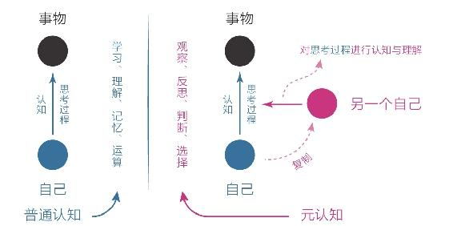

激活、强化元认知，有一个重要的方法：**在选择的节点上多花“元时间”**。“元时间”通常出现在选择的节点上，这些时间的权重远远大于其他时间，倘若我们能够善用这些时间，就能提高我们利用后续时间的质量。在元时间内，我们需要做最重要的一件事，就是“**想清楚**”：**在选择的节点，要审视自己的第一反应，并产生清晰明确的主张**。

元认知强的一个重要表现是：**对模糊零容忍**。当我们行动力弱的时候，对未来的具体行动肯定是模糊不清的，那么就需要把想做的事情都列出来，按重要性来排序，找到最重要的那件事，让脑子清醒，消除模糊。不仅在日常小事上我们需要消除模糊，在选择人生目标等关键大事上我们更需要消除模糊。我们要想清楚人生的意义和自己所做的事情的意义，进行自我审视和控制，而不是随波逐流。

我们需要成为一个元认知能力和自控力强的人，主动掌管自己的人生，成为自己的思维舵手，主要有三种方法：

* 针对当下的时间，保持觉知，审视第一反应，产生明确的主张；
* 针对全天的日程，保持清醒，时刻明确下一步要做的事情；
* 针对长远的目标，保持思考，想清楚长远意义和内在动机。

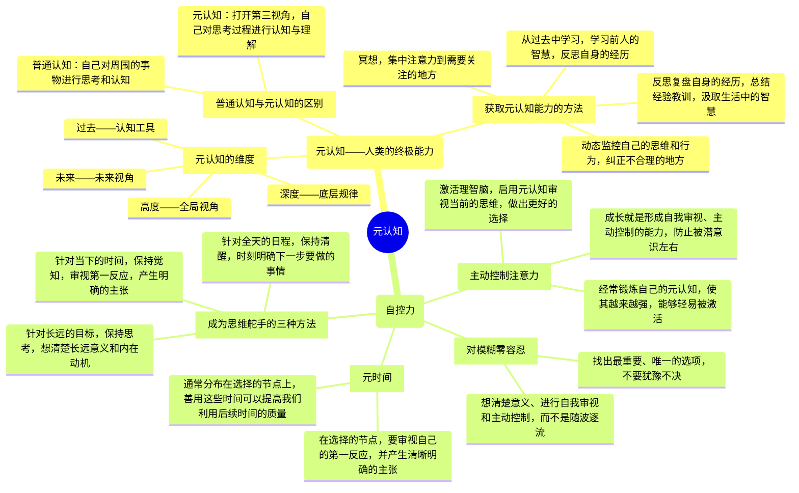

## 下篇 外观世界，借力前行

### 第四章 专注力——情绪和智慧的交叉地带

#### 情绪专注

很多时候，我们一种司空见惯的情况是：身体在做着 A，脑子却想着 B，俗称分心、开小差。不过很多人不觉得这是个问题，甚至对自己能够一心二用沾沾自喜。然而，这样的方式会使得我们思维更加愚钝，使得我们做事拖延和低效，使得我们生活质量降低，对我们的思维和成长都有种种不利的影响。

分心走神的原因主要有两个：<b>一是觉得当下最无聊，所以追求更有意思的事情；二是觉得当下太痛苦，所以追求更舒适的事情。</b>这和人类急于求成、避难趋易的天性是一致的。分心的本质是逃避，在面对困难时，身心分离的人会不自觉地退回舒适区；而身心合一的人则更容易跳出舒适区，直面困难。

由于我们的潜意识总是在控制我们的感官，只要我们醒着，分心走神的现象就随时可能发生。所以我们要动用元认知的能力，因为成长就是克服天性的过程，我们需要通过觉知力和自控力，约束我们的天性，避免让自己被潜意识左右而不自知。

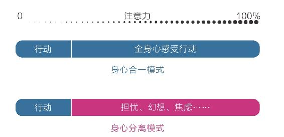

如果一个人从小养成了全情投入和界限清晰的专注习惯，就不仅能获得智力上的聪慧，也能获得情绪上的平和，久而久之就会和普通人拉开巨大差距。如果我们更早地知道这一原理，并用其指导自己的思维和行动，主动运用、修正，或许我们的命运轨迹和生活质量就会有所不同。好在我们现在知道也不晚，我们通过这一招就可以养成自己的专注习惯：**让感受回归行动**。我们需要**专注于当下，享受当下**，慢慢练习收回感受，让注意力回归当下，从而改变底层的行为模式，收获更高效、更平和、更从容的人生。

#### 学习专注

学习专注主要包括**主动选择信息的能力**和**深度沉浸的能力**。

人类情绪和能力的优劣差异来自于对自身注意力关注方式的差异。能力弱的人容易分心，需要在理想的环境中才能学习，容易被外界信息干扰；能力强的人能够主动屏蔽干扰，选择需要的信息并沉浸其中，甚至会故意在嘈杂的环境中锻炼自己。因为沉浸能力的不同，人类最终处在了不同的层次，沉浸能力强的人通常处在支配层，沉浸能力弱的人通常处在被支配层。

因此我们需要养成**深度沉浸**的能力。这个世界上能聚焦的人很多，但卓越的人很少，根本原因就是大多数人缺乏深度沉浸的能力。深度沉浸是有一套方法论的，本质上就是**正确的方法**加上**大量的练习**。

**正确的方法**主要有以下四个特征：

1. **有定义明确的目标**，让目标更加精细、具体，提高注意力的感知精度，让精力更集中、技能更精进。
2. **练习时极度专注**，做一件事情的时候就专心想着那件事情，让潜意识被激活，提升自己的思考能力，让自己变聪明。
3. **能获得有效的反馈**，想办法得到即使、有效的知道和反馈，让自己更加了解自己所存在的不足，更好地提升个人能力。
4. **始终在拉伸区练习**，每天都做让自己感到有些困难但可以通过努力来达到的事情，跳出舒适区，避开困难区，处在拉伸区。

除了正确的方法之外，我们还需要通过大量的练习来实践这些方法，从而拥有深度沉浸的能力，精进自己的技能，走向某一领域的高处。

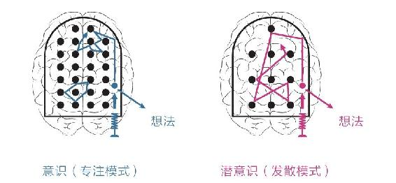

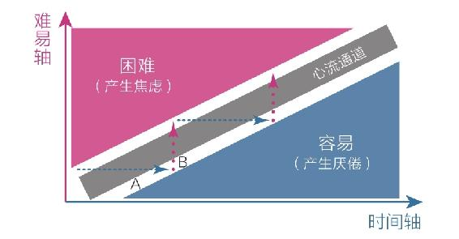

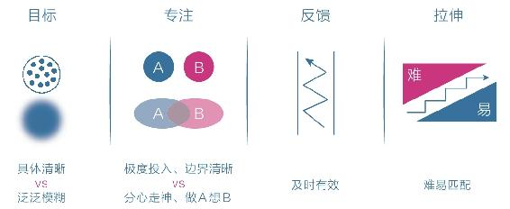

我们可以通过这些角度审视自己：

* 审视自己的注意力——是被动吸引还是主动选择？
* 审视自己的沉浸度——是分心走神还是极度专注？
* 审视自己的练习量——是浅尝辄止还是大量投入？

通过审视自己，用心养成深度沉浸的良好习惯，我们就能在进化的大潮中成就自己，造福他人。

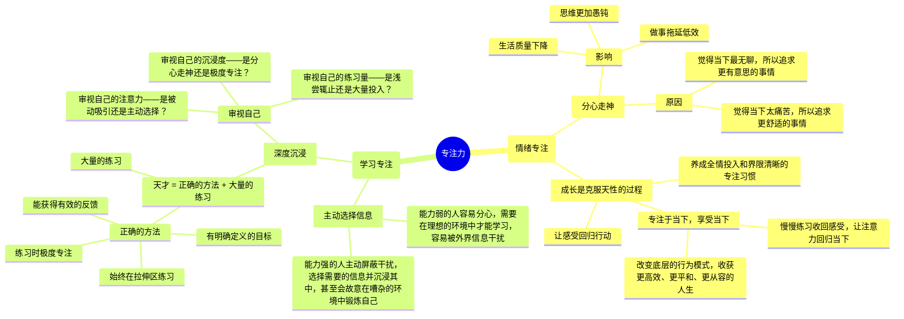