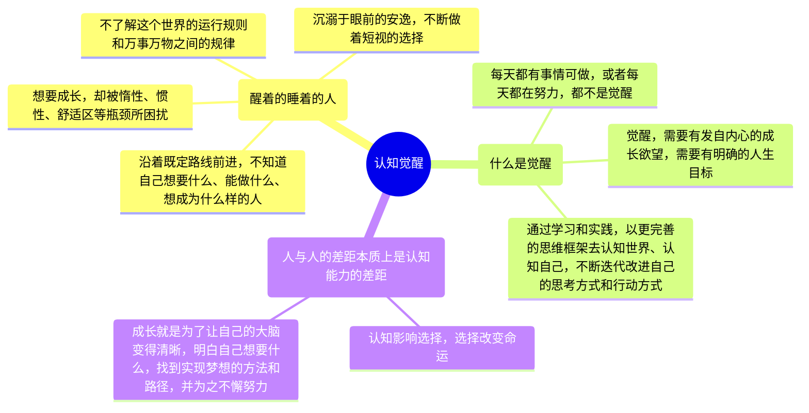

# 周岭《认知觉醒：改变自我的原动力》阅读笔记

## “醒着的睡着的人”

我们每个人一生下来的时候认知都是混沌的，人生观、价值观、世界观都是从零开始的。许多人天生追求一种简单、舒适、轻松的生活方式，被这样的天性支配着，身陷其中而不自知。

我们很多人都活在一个“**醒着的睡着的人**”这样的状态里。许多人都沿着求学—工作—婚恋这样的既定路线前进，不断适应社会的规则，应对生活的烦恼，随波逐流，不断做着短视的选择，沉溺于安逸之中，不了解这个世界的运行规则和万事万物之间的规律，不知道自己想要什么、能做什么、想成为什么样的人。

而一小部分的人意识到了这样的困局，跳出了成长的陷阱，刻意逼迫提升自己。然而他们在成长的过程中也遇到了不少瓶颈——想努力，却被惰性所困；想改变，却被惯性所束缚；想成长，却被舒适区所困扰。

那么我们如何成为一个努力成长、高效提升的人呢？我们需要做的事情，总结为四个字，就是“**认知觉醒**”。什么是觉醒呢？每天忙忙碌碌有事情做，这不是觉醒；每天都努力地把手头的事情做完，这也不是觉醒。真正的觉醒，就是要有一种发自内心的成长欲望，给自己制定明确的人生目标，并通过学习和实践，以更完善的思维框架去认知世界、认知自己，不断迭代改进自己的思考方式和行动方式，最终接近并达成自己的人生目标。

<b>人与人的差距本质上是认知能力的差距。</b>认知影响选择，选择改变命运。成长就是为了让自己的大脑变得清晰，明白自己想要什么，找到实现梦想的方法和路径，并为之不懈努力。

