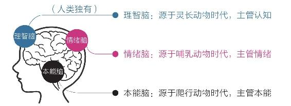
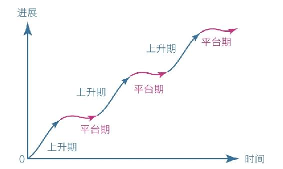

# 《认知觉醒：开启自我改变的原动力》

## 自序：开启自我改变的原动力

* **心智**——我们看待人和事的**态度**，以及由此做出的**判断**与**选择**
* **跳出成长的陷阱，刻意提升自己！**
* 每个人生来都是混沌无知的，人生观、价值观、世界观都是从零开始的，这种混沌和无知使自己看起来就像一个“**醒着的睡着的人**”。
* 不断服从社会的规则，随波逐流
    * 没有多少压力，也没有多少动力
    * 总是沉溺于眼前的安逸，做着短视的选择
    * 对世界的运行规则浑然不知
        * 不知道事物的构成、框架
        * 不知道努力的路径、方法
        * 也不知道自己真正想要什么、能做什么、最后会成为什么样的人……
    * 迷迷糊糊到了某个年纪，发现自己对这个世界已经无能为力了
    * 在成长的过程中，遇到瓶颈
        * 想勤奋，却总是敌不过惰性；想努力，却总是陷入低效的状态；想精进，面前却总是弯路不断
        * 读了很多书，都忘了；付出很多努力，都白费了
        * 仿佛越使劲越困惑，越努力越迷茫
* 反思自己
    * 如果意外发生在自己身上，如果现有的一切被“剥夺”，我还有什么、会什么，又曾在这个世界上留下了什么？
    * 要改变现状，不能再这样下去了
        * 让脑子变清晰，不再稀里糊涂
        * 掌握更多技能，不再遇事无计可施
        * 主动创造成就，不再被动承受现状……
* 探索自己
    * **觉醒是什么？**
        * 每天有事情做不代表觉醒，每天都努力也不代表觉醒
        * 真正的觉醒是一种发自内心的渴望，立足长远，保持耐心，运用认知的力量与时间做朋友
    * **人与人的差异是认知能力上的差异**
        * 认知影响选择，选择改变命运
        * 成长的本质就是让大脑的认知变得更加清晰
        * 要广泛涉猎知识，看到自己成长的可能性，明白自己想要什么，了解世界的规律和真相，找到实现梦想的方法和路径

## 上篇：内观自己，摆脱焦虑

### 第一章 大脑——一切问题的起源

#### 第一节 大脑：重新认识你自己

* **三重大脑**
    1. **本能脑**——源于爬行动物时代，主管本能
    2. **情绪脑**——源于哺乳动物时代，主管情绪
    3. **理智脑**——源于灵长动物时代，主管认知

    
* **高低之分与权力之争**
    * 比起本能脑和情绪脑，理智脑实在是太弱小了
        * **出现年代**：本能脑（3.6亿年） > 情绪脑（2亿年） > 理智脑（250万年）

            
        * **发育成熟时间不同**：本能脑（婴儿时期） → 情绪脑（青春期） → 理智脑（成年早期）
        * **大脑结构特征**：
            * 人的大脑约有860亿个神经元，其中本能脑和情绪脑占了80%，所以对大脑掌控力最强
            * 本能脑、情绪脑离心脏更近，紧急情况下优先得到血液供应，理智脑反而缺血，所以会导致我们紧急情况下大脑一片空白。
        * **运行效率**：
            * 本能脑、情绪脑掌管潜意识和生理系统，运行速度极快；
            * 理智脑运行速度慢得多，且非常耗能。
    * 因为**理智脑对大脑的控制能力很弱**，所以我们在生活中做的大部分决策**往往源于本能和情绪，而非理智**
        * 本能脑、情绪脑——**目光短浅，即时满足** → 塑造了人的默认天性：**避难趋易、急于求成**
            * **避难趋易**——只做简单和舒适的事，喜欢在核心区域周边打转，待在舒适区内逃避真正的困难；
            * **急于求成**——凡事希望立即看到结果，对不能马上看到结果的事往往缺乏耐心，非常容易放弃。
        * 理智脑——**明明知道，但就是做不到；特别想要，但就是得不到**
            * 事实上理智脑很少有主见，**大多数时候我们以为自己在思考，其实都是在对自身的行为和欲望进行合理化**，这正是人类被称作“自我解释的动物”的原因。
* **成长就是克服天性的过程**
    * 人生来混沌，根本原因就是理智脑太过薄弱，无力摆脱本能脑和情绪脑的压制与掌控，**而觉醒和成长就是让理智脑尽快变强，以克服天性。**
    * 理智脑发达的人更能：
        * 立足长远，主动走出舒适区；
        * 为潜在的风险克制自己，为可能的收益延时满足；
        * 保持耐心，坚持做那些短期内看不到效果的“无用之事”；
        * 抵制诱惑，面对舒适和娱乐时，做出与其他人不同的选择……
    * **习惯之所以难以改变，就是因为它是自我巩固的——越用越强，越强越用。**
        * **要想从既有的习惯中跳出来，最好的方法不是依靠自制力，而是依靠知识**，因为单纯地依靠自制力是非常痛苦的事，但知识可以让我们轻松产生新的认知和选择。
    * 让理智脑更强大，不是要抹杀本能脑和情绪脑；它们三位一体，缺一不可。
        * 本能脑强大的运算能力和情绪脑强大的行动能能力，都是不可多得的宝贵资源
        * 让理智脑变强，不是为了对抗或取代本能脑和情绪脑
        * **理智脑不是直接干活的，而是用来驱动本能脑和情绪脑**

#### 第二节 焦虑：焦虑的根源

* **焦虑之战**
    * 无论个体还是群体，人类的安全感都源于自己在某一方面拥有的独特优势：或能力，或财富，或权力，或影响力。
* **直面焦虑**
    * 焦虑的几种形式：
        1. **完成焦虑**：每天活在截止日期面前，因为欲望涉及面广或者外在日程安排过金，难以做到深入和从容。
        2. **定位焦虑**：在零基础阶段直视某领域能人的所作物哦为，对自己的定位错误对标。
        3. **选择焦虑**：面对众多选择，摇摆不定，静不下心做最重要的事，或者不知道最重要的事情是什么；或者面对能人的观点感到纠结，无法作出决断。
        4. **环境焦虑**：受家庭、工作等外在环境的影响，有的事情不得不做，有的事情想做却不能做，在低效与无力中感到抓狂。
        5. **难度焦虑**：有的事情核心困难是无法回避的，不下决心与之死磕，始终在周围打转，时间越长越焦虑。
* **焦虑的根源**
    * 焦虑的原因：**想同时做很多事，又要立即看到效果**
        * **急于求成，想同时做很多事；避难趋易，想不怎么努力就立即看到效果。**
        * 焦虑是天性，是人类的默认状态。进入信息社会后，由于节奏变快竞争更强，这种焦虑被放大了。
    * 如何改变自己：**看清背后的机理并设法改变**
        * 克制欲望，不要让自己同时做很多事；
        * 面对现实，看清自己真实的能力水平；
        * 要事优先，想办法只做最重要的事情；
        * 接受环境，在局限中做力所能及的事；
        * 直面核心，狠狠逼自己一把去突破它。
    * **耐心**——人类最珍贵的品质
        * 直指我们急于求成、避难趋易的天性
        * **得耐心者得天下**

#### 第三节 耐心：得耐心者得天下

* **即时满足**——人类天性中最原始、最本能的部分
    * 现实生活中无论读书、考试，还是工作、赚钱，要想表现出色都必须经受长时间的磨炼
    * 要想有所成就，就必须克服即时满足的天性，**学会耐心**
* 很多人虽然嘴上说要保持耐心，但身体却诚实地游走在即时满足的边缘
* **缺乏耐心，是人类的天性**
    * **社会中的精英通常是那些能更好地克服天性的人，他们的耐心水平更高，延迟满足的能力更强。**
* 很多时候，我们对困难的事物缺乏耐心是因为看不到全局、不知道自己身在何处，所以总是拿着天性这把短视之尺到处衡量，以为做成一件事很简单。事实上，如果我们能了解一些事物发展的基本规律，改用理性这把客观之尺，则会极大地提升耐心。
    * **复利曲线**
        * 前期增长非常缓慢，但到达一个拐点后会飞速增长

            
    * **舒适区边缘**
        * 无论个体还是群体，其能力都以“**舒适区—拉伸区—困难区**”的形式分布
            * 要想让自己高效成长，必须让自己始终处于舒适区的边缘
            * 贸然跨到困难区会让自己受挫
            * 始终停留在舒适区会让自己停滞
        * 人类的天性正好与这个规律相反
            * 在欲望上急于求成，总想一口吃成个胖子，导致自己终日在困难区受挫
            * 在行动上避难趋易，总是停留在舒适区，导致自己在现实中总是一无所获
            * 如果我们学会在舒适区边缘努力，那么收获的效果和信心就会完全不同

            
    * **成长权重对比**
        * 对于学习而言，学习之后的思考、思考之后的行动、行动之后的改变更重要
        * 如果不盯住内层的改变量，那么在表层投入再多的学习量也会事倍功半
        * 从权重上看：**改变量﹥行动量﹥思考量﹥学习量**

            
        * 很多人之所以痛苦焦虑，就是因为只盯着表层的学习量
            * 保持学习输入是简单的，而思考、行动和改变则相对困难
            * 我们会本能地**避难趋易**，不自觉地沉浸在表层的学习量中
            * 表层的学习量是最能直接看到效果的，而底层的改变却不怎么容易发生，所以急于求成的天性也会促使我们选择前者
        * **深入底层，盯住实际改变**，我们就能跳出盲目、焦虑、浮躁的怪圈
    * **平台期**
        * 学习进展和时间不是线性的关系，而是波浪式上升的曲线

            
        * 任何学习都是这样，刚开始时进步很快，然后会变慢，进入一个平台期
        * **不要放弃，面对挫折和失败要继续坚持，才能突破平台期**
* **耐心不是毅力带来的结果，而是具有长远目光的结果。**这也意味着我们需要**终身学习**。
    * 当我们知道的规律越多，就越能定位自己所处的阶段和位置、预估未来的结果，进而增强自己持续行动的耐心。毫无疑问，对外部世界的规律的认知能使我们耐心倍增。
* **怎样拥有耐心**
    * 首先，面对天性，放下心理包袱，坦然接纳自己
    * 其次，面对诱惑，学会延迟满足，变对抗为沟通
    * 最后，面对困难，主动改变视角，赋予行动意义
    * **最高级的方法：请本能脑和情绪脑出动来解决困难**

### 第二章 潜意识——生命留给我们的彩蛋

#### 第一节 模糊：人生是一场消除模糊的比赛

* 机器人与人最大的区别——机器人没有潜意识
* 为了更好地生存，进化之手巧妙地采用了**意识分层**的手段，它让潜意识负责生理系统，让意识负责社会系统，如此分工，意识便得到了解放，可以全力投入高级的社会活动
    * 意识分层是一把双刃剑，在给人类带来巨大好处的同时，也带来了副作用——**模糊**。
    * 因为处理各种信息的速度不对等，意识很难介入潜意识，而潜意识却能轻易左右意识，所以人们总是做着自己不理解的事。这种模糊让人心生迷茫和恐惧，而迷茫和恐惧又使我们的认知、情绪和行动遭遇各种困扰，继而影响人生的走向。
    * 模糊，正是人生困扰之源；人生也是消除模糊的比赛。
* **学习知识，消除认知模糊**
    * 掌握的工具越多，认知能力越强，消除模糊的能力就越强。
    * 不幸的是，人类天生不喜欢学习和思考，因为这类事极其耗能；而潜意识没有思维，只有本能，会让身体走低能耗路线，诱导我们娱乐、享受，**所以本能通常都是阻碍学习的，而人若不学习，又无力克服本能。** 这个怪圈使我们在人生的初始阶段必然陷入混沌，若非外力压迫或牵引，我们往往很难跳出。
    * 时代的发展为我们提供了更多的学习机会和更好的学习环境，我们主动进入反本能成长的可能性也越来越大。有意思的是，**学习知识的目的是“消除模糊”，而获取知识的方法也是“消除模糊”，目的和方法相统一**，这几乎成了这个世界上所有能人共同遵守的学习法则。
    * **提升思考能力的方法正是不断明确核心困难和心得感悟，并专注于此。**
        * 现实中，很少有人能清醒地意识到这一点。人们总是习惯在模糊区打转，在舒适区兜圈，重复做已经掌握的事情，对真正的困难视而不见，这背后都是潜意识在操控——因为基因认为这样做耗能更低。
        * 优秀的人更倾向于做高耗能的事——消除模糊，制造清晰。
* **拆解烦恼，消除情绪模糊**
    * 认知模糊来自内部，而情绪模糊来自外界。
        * 人们每天都会面临各种烦恼，但多数人习惯被动承受，少有人乐于主动面对。
        * 虽然被动地承受痛苦也会耗费很多能量，但在基因的影响下，人就是不喜欢主动耗能。多数人为了逃避思考，愿意做任何事情。
    * 回避痛苦并不会使痛苦消失，反而会使其转入潜意识，变成模糊的感觉。**而具体事件一旦变模糊，其边界就会无限扩大，原本并不困难的小事，也会在模糊的潜意识里变得难以解决。**
        * 真正的困难总比想象的要小很多。人们拖延、纠结、畏惧、害怕的根本原因往往不是事情本身有多难，而是内心的想法变得模糊。
    * 任何痛苦事件都不会自动消失，哪怕再小的事情也是如此。**要想不受其困扰，唯一的办法就是正视它、看清它、拆解它、化解它，不给它进入潜意识的机会，不给它变模糊的机会；即使已经进入潜意识，也要想办法将它挖出来。**
    * **恐惧就是一个欺软怕硬的货色，你躲避它，它就张牙舞爪，你正视它，它就原形毕露。**
* **里清外明，消除行动模糊**
    * **行动力不足的真正原因，是选择模糊**。
    * **选择模糊**，就是我们在面对众多可能性时无法做出清晰、明确的选择。
        * 这样的情况很常见，比如当你心中有很多欲望、脑中有很多头绪，或者拥有可自由支配的时间时，你就会进入“既想做这个，又想做那个；既可以做这个，又可以做那个”的状态，就像自己始终站在十字路口，却不知道该往哪里去，从而使自己陷入一种不确定性之中。
    * **人类面对不确定性时，会不自觉逃避。当我们没有足够清晰的指令或者目标时，就很容易选择享乐，放弃那些本该坚持但比较烧脑的选项。**
    * 要想让自己更胜一筹，就必须学会花费更多的脑力和心力去思考**如何拥有足够清晰的目标**。我们要把目标和过程细化、具体化，**在诸多可能性中建立一条单行通道，让自己始终处于“没得选”的状态。**

#### 第二节　感性：顶级的成长竟然是“凭感觉”

* **潜意识的智慧**
    * 潜意识的特点：
        * 潜意识没有思维，只关心眼前的事物，喜欢即刻、确定、简单、舒适——**天性的部分**
        * 潜意识处理信息速度极快，能极其敏锐地感觉到很多不易察觉的信息——**感性的部分**
    * **“凭感觉”——察觉潜意识发出的信息**
* **凭感觉学习**
    * 高手学习的方法：**先用感性能力帮助自己选择，再用理性能力帮助自己思考。**
    * 理性、感性、天性的选择倾向：

        
* **凭感觉寻找人生目标**
    * 感性的力量适用于生活的方方面面，尤其在面临重大的人生问题时，如选择伴侣、确定职业、寻找人生目标等。
    * 一个人若是没有人生目标，纵然每天有吃、有喝、有书读、有班上，也会像一个迷失的人一样，内心没有喜悦、生活没有激情，甚至会厌恶自己，因为**目标是存放我们热情和精力的地方**。
        * 很多人会把自己的人生目标定位为“变得很有钱”或“被别人崇拜”，这样的目标不能说有错，但**往往不能长久，也无法给人真正的动力**，因为这是**理性思考和权衡利弊后的结果**，其动机往往来自“自我索取和外在评价”，**时间一长，很容易让人迷失方向，使动力枯竭。**
    * 真正的觉醒者往往会有意无意地**用感知力来代替思考力**。
    * **理性思维虽然很高级，但在判断与选择方面可能并不具有优势，它那蹩脚的性能实在无法与灵敏快速的感性媲美。所以，先用感性选择，再用理性思考，或许是一个更好的策略，尤其是在做那些重大选择时。**
* **如何捕捉感性**
    1. **“最”字法**：关注罪出动自己的点，并深入分析挖掘，往往会有丰厚的收获。
    2. **“总”字法**：审视并去消除不自觉重复跳出来的某些念头，或者心中总是挥之不去的事，让自己变得更加平和。
    3. **无意识的第一反应**：关注自己脑海中出现的第一个想法，这往往是来自潜意识的真实信息。
    4. **梦境**：是潜意识传递信息的一种方式，可能是内心真实想法的展示，也可能是灵感的启发。
    5. **身体**：无论生理还是心理上的不适，都会通过身体如实地反映出来，需要我们多去关注。
    6. **直觉**：给一些来路不明、无法解释的信息开绿灯。

### 第三章 元认知——人类的终极能力

#### 第一节 元认知：成长慢，是因为你不会“飞”

* **万物之灵”的根源**
    * 元认知，就是最高级别的认知，**它能对自身的“思考过程”进行认知和理解**。

        
    * 人类的大脑进化出了新皮层，这使我们具备了**极强的感知和思考能力**，从而可以**依靠理智生活**，而其他动物则只能依靠本能和情绪来生存。更神奇的是，人类还可以**观察自己的思维活动**，找出其中不合理的地方，然后**改进优化，不断做出更好的选择**。
* **元认知能力的差异**
    * **被动元认知和主动元认知**
        * 普通人通常只会在遇到问题时被迫启用这个能力，比如遭遇指责、批评时，才不得已去反思纠正；处于顺境时，依旧会顺着本性生活。**而有些人即使在没有威胁的情况下也会尝试练习扇动翅膀，让自己不断进化，彻底远离危险。**
        * 从被动到主动，这是一个转折点。当一个人能主动开启第三视角、开始持续反观自己的思维和行为时，就意味着他真正开始觉醒了，他有了快速成长的可能。
* **元认知如何改变我们的命运**
    * **反观**，是元认知的起点。
        * **你能意识到自己在想什么，进而意识到这些想法是否明智，再进一步纠正那些不明智的想法，最终做出更好的选择。**
        * 缺乏自我观察意识的人只能无意识地顺着感觉和喜好行事，无论在生理上还是在精神上，都会不自觉地追求眼前的舒适和简单，觉察不到自己当前的思维和行为有什么不妥，直到碰壁。**而人生是由无数个选择组成的，不同选择的累加造就了不同的人生。**
    * 元认知一旦开启，变化就会马上发生。
        * 想象自己身边有一个“灵魂伴侣”，时刻伴随，指引着你。
            * 在你走神时，他会提醒你集中注意力，去做更重要的事；
            * 在你迷茫时，他会站在人生高处，帮你看清局势和格局；
            * 在你生气时，他会帮你梳理情绪，找到比生气更好的选择；
            * 在你无解时，他会深入底层规律，提示你应该抓住什么；
            * 在你懈怠时，他会站在人生的终点，警醒你现在应该做什么……
        * **高级的元认知**：时刻帮你从高处、深处、远处看待现在的自己，让自己保持清醒、不迷失，保持动力、不懈怠，保持平和、不冲动。

            
* **如何获取元认知能力**
    1. **需要从“过去”端获取，包括学习前人的智慧和反思自身的经历。** 拓宽全局视角（高度）、掌握更深的底层规律（深度），帮助我们做出更加正确的选择。
    2. **自身的经历更是一种独特的财富。** 反思复盘有什么经验可以获得、有什么教训可以吸取，帮助自己避免作出不够明智的选择。
    3. **启用你的灵魂伴侣。** 让灵魂伴侣时刻监控你，让你审视自己的行为，把注意力防盗原来的目标上，去聚焦、去成长。
    4. **冥想。** 监控自己的注意力，集中到自己需要关注的地方。

#### 第二节 自控力：我们生而为人就是为了成为思维舵手

* **元认知能力就是觉察力和自控力的组合**
    * 元认知能力可以被重新定义为：**自我审视、主动控制，防止被潜意识左右的能力。**
* **我们天然被潜意识左右**
    * 很多人为了获得美好的人生，常常给自己立下早起、跑步、阅读、写作等目标，但是没过几天就放弃了，因为那些目标大多是受大环境影响而跟风设定的——别人说好，自己也想要，但实际上，自己并不需要。**仔细想想就会发现，这仍然是我们的第一反应，是潜意识在左右我们，我们并没有真正进行自我审视和主动控制。**
    * 从当下，到每天，再到一生，我们都天然被潜意识左右着。
* **成长就是为了主动控制**
    * 理智脑的战斗力表现在两方面：
        * 一方面是侧重学习、理解、记忆、运算的**认知能力**，即我们在校学习时主要锻炼的部分
        * 另一方面则是侧重观察、反思、判断、选择的**元认知能力**

        
    * 遗憾的是，我们大多数人虽然在学校集中锻炼了认知能力，但对元认知能力的锻炼却很少涉及。这也是很多人活了几十岁依然执行力不强、专注力不够、意志力不足的原因。所以，一个人要想掌握命运之船的风帆，就必须**主动、刻意地锻炼自己的元认知能力**，**让理智脑更多地参与大脑的决策**，掌握大脑的**主导权**，这样，我们就会比一般人走得更快、更远。
        * **主导权易手**的过程中，一个人会表现出的明显特征是：**能够主动控制注意力，不会被随机、有趣的娱乐信息随意支配。**
        * **每当遇到需要选择的情况时，我们要是能先停留几秒思考一下，就有可能激活自己的理智脑，启用元认知来审视当前的思维，然后做出不一样的选择。**
    * 种种迹象表明，那些有影响力的杰出人士与普通人的差距普遍体现在元认知领域，前者总是能在大大小小的选择关口上，展现摆脱潜意识支配的能力，从而尽可能地观察与思考身处的环境、自己的行为、与他人的关系等，给出有理有据的见解，做出更好的选择。
        * 真正的竞争力不在于学习能力，而在于强大的元认知能力。
        * 我们要想办法**锻炼自己的元认知**，就像锻炼我们的肌肉一样，只要经常锻炼，它们就会越来越强，能被轻易激活。
        * **一定要在选择节点上多花“元时间”。**
* **成为自己人生的思维舵手**
    * 有的时间权重要远远大于其他时间，称为**元时间**。
        * **所有面临选择的时间节点，都可以被称作“元时间”，比如一件事情、一个阶段或一天开始或结束时。** 善用这些时间会极大程度地优化后续时间的质量。
        * 我们不能在这个时候丧失主动权，任由本能左右自己进入下一个阶段，尤其是在面对诱惑或困难的时候。
        * “元时间”内我们就做一件事：**想清楚**。
            * **在选择的节点审视自己的第一反应，并产生清晰明确的主张。**
            * 元认知能力强的一个突出表现是：**对模糊零容忍**。
                * 想尽一切办法让自己找出那个最重要的、唯一的选项，让自己在某一个时间段里只有一条路可以走。
                * 犹豫不决，什么都想做又什么都做不好，才是最大的损失。
                * **自己行动力弱的时候，脑子里对未来的具体行动肯定是模糊不清的。**在这个时候，最好的自救方法就是**把所有想做的事情都列出来，进行排序，找出最重要的那件事，让脑子清醒。**
                    * **模糊，不仅需要在这些小事上消除，在选择人生目标等大事上也是如此。**
                    * 现实生活中，我们总是想都不想就一头扎进具体事情里，对什么事情更重要、什么事情最重要、做这件事对自己到底意味着什么等长远意义却极不清楚。
                    * **焦虑的人很少有“元时间”的意识，他们习惯不动脑子、直接行动，喜欢用饱和的行动来感动自己，想与做的时间配比差距悬殊，他们甚至连一丁点儿深入思考的时间都不愿意花，任由本能欲望让自己迷失在自我满足的行动里。**
    * **成为思维舵手的三种方法：**
        1. 针对当下的时间，**保持觉知，审视第一反应，产生明确的主张**；
        2. 针对全天的日程，**保持清醒，时刻明确下一步要做的事情**；
        3. 针对长远的目标，**保持思考，想清楚长远意义和内在动机**。
    * 元认知能力强的人就是这样：**无论是当下的注意力、当天的日程安排，还是长期的人生目标，他们都力求想清楚意义、进行自我审视和主动控制，而不是随波逐流。**
        * 元认知能力强的人时刻掌握方向舵，主动控制生命之船的航向；元认知能力弱的人只会当忙碌的水手，船漂到哪里算哪里。
        * 每克制自己一次，就相当于进行了一次自我审视和主动控制，相当于进行了一次锻炼。