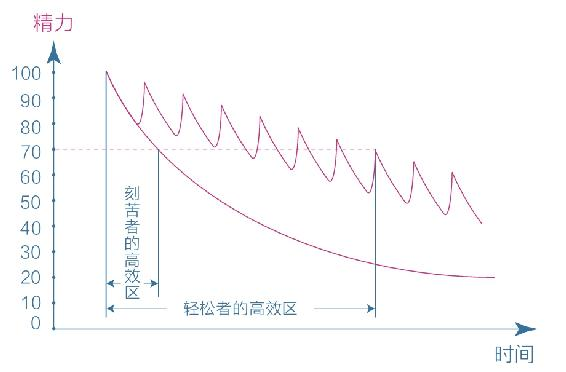

# 周岭《认知觉醒：改变自我的原动力》阅读笔记

## 自序 开启自我改变的原动力

我们每个人一生下来的时候认知都是混沌的，人生观、价值观、世界观都是从零开始的。许多人天生追求一种简单、舒适、轻松的生活方式，被这样的天性支配着，身陷其中而不自知。

我们很多人都活在一个“**醒着的睡着的人**”这样的状态里。许多人都沿着求学—工作—婚恋这样的既定路线前进，不断适应社会的规则，应对生活的烦恼，随波逐流，不断做着短视的选择，沉溺于安逸之中，不了解这个世界的运行规则和万事万物之间的规律，不知道自己想要什么、能做什么、想成为什么样的人。

而一小部分的人意识到了这样的困局，跳出了成长的陷阱，刻意逼迫提升自己。然而他们在成长的过程中也遇到了不少瓶颈——想努力，却被惰性所困；想改变，却被惯性所束缚；想成长，却被舒适区所困扰。

那么我们如何成为一个努力成长、高效提升的人呢？我们需要做的事情，总结为四个字，就是“**认知觉醒**”。什么是觉醒呢？每天忙忙碌碌有事情做，这不是觉醒；每天都努力地把手头的事情做完，这也不是觉醒。真正的觉醒，就是要有一种发自内心的成长欲望，给自己制定明确的人生目标，并通过学习和实践，以更完善的思维框架去认知世界、认知自己，不断迭代改进自己的思考方式和行动方式，最终接近并达成自己的人生目标。

<b>人与人的差距本质上是认知能力的差距。</b>认知影响选择，选择改变命运。成长就是为了让自己的大脑变得清晰，明白自己想要什么，找到实现梦想的方法和路径，并为之不懈努力。

## 上篇 内观自己，摆脱焦虑

### 第一章 大脑——一切问题的根源

#### 三重大脑

人的大脑可以分为三个部分：**本能脑**、**情绪脑**、**理智脑**。

* **本能脑**：源于爬行动物时代，主管本能
* **情绪脑**：源于哺乳动物时代，主管情绪
* **理智脑**：源于灵长动物时代，主管认知

理智脑是人类独有的。它让我们产生了语言、创造艺术、发展科技、建立文明的能力，使得人类在地球上占据了独立的生存优势。

然而，我们的理智脑相比本能脑、情绪脑实在是太弱小了。主要是由四个原因造成的：

1. 从发展历史看，本能脑发展历史最早，情绪脑次之，而理智脑的发展历史远远晚于前两者；
2. 从发育阶段看，一个人的本能脑在婴儿时期就基本发育完成了，情绪脑则是在青春期发育完成，而理智脑要到成年早期才能发育成熟；
3. 从大脑组成看，本能脑和情绪脑在大脑中占据的神经元细胞达到近八成，远远多于理智脑的占比；
4. 从运行速度看，四是本能脑和情绪脑掌握着潜意识和生理系统，运行速度极快；而理智脑运行速度慢，并且非常耗能。

 

由于本能脑和情绪脑一直被生存压力塑造着，因此养成了**目光短浅、即时满足**的天性，又因为它们对人的大脑决策强大的支配地位，所以人们**大部分的决策往往源于本能和情绪，而非理智**。大脑的这种构造也是人类形成**避难趋易、急于求成**的天性的根源，使得我们总是陷入“**明明知道，但就是做不到；特别想要，但就是得不到**”的怪圈。很多时候我们以为自己在思考，其实那只是在为自己的行为和欲望进行合理化的解释。

成长，就是要克服我们这种**避难趋易、急于求成**的天性，让自己的理智脑变得更加强大，让自己的大脑变得更加清晰，让自己的思考更加理性，让自己的行动更加高效。因此，我们需要养成经常思考、时常反思的习惯，让自己的理性思维占据思维的主导，养成良好的思考习惯。

<b>习惯之所以难以改变，就是因为习惯是自我巩固的——越用越强，越强越用。</b>要想从既有的习惯中跳出来，靠自制力是不够的，我们需要依靠知识，让知识帮助我们产生新的认知和选择。

但是，这并不意味着要抹杀我们的本能脑和情绪脑，事实上也抹杀不了。我们需要做的是，让理智脑成为大脑的主导，让本能脑和情绪脑成为理智脑的助手，让它们为我们服务，而不是让它们主宰我们。

#### 焦虑

由于**避难趋易、急于求成**的天性，我们经常会陷入焦虑之中。焦虑的根源主要有两个：

1. 急于求成，想同时做很多事；
2. 避难趋易，想不怎么努力就立即看到效果。

常见的焦虑形式有：

1. 完成焦虑
2. 定位焦虑
3. 选择焦虑
4. 环境焦虑
5. 难度焦虑

#### 耐心

由于本能脑和情绪脑强大的支配地位，使人们形成了**避难趋易、急于求成**的天性，这种天性使得我们缺乏耐心，缺乏长远的目光，缺乏坚持的毅力，缺乏克服困难的勇气。

我们可以通过学习一些认知规律，来增强我们的耐心：

1. **复利效应**：前期增长非常缓慢，但到达一个拐点后会飞速增长。选择正确的方向，冷静面对眼前缓慢的增长，并刻意练习，直到有所成就。
2. **舒适区—拉伸区—困难区**：无论个体还是群体，能力都以“舒适区、拉伸区、困难区”的形式分布。在舒适区的边缘，进入拉伸区，成长最快。
3. **成长权重**：学习不是目的，而是手段。学习之后的思考、思考之后的行动、行动之后的改变更重要。从权重来看：**改变量﹥行动量﹥思考量﹥学习量**。
4. **平台期**：我们的学习进展和时间的投入并不是线性关系。刚开始学习时，进展很快，但到达一个拐点后，进展会变得非常缓慢，进入平台期。在平台期，不要选择放弃，要懂得继续坚持。耐心不是毅力带来的结果，而是具有长远目光的结果。

<table>
    <caption>认知规律</caption>
    <tbody>
        <tr>
            <td>
                <figure>
                    
                    <figcaption>复利曲线</figcaption>
                </figure>
            </td>
            <td>
                <figure>
                    
                    <figcaption>在舒适区边缘扩展自己的行动范围</figcaption>
                </figure>
            </td>
        </tr>
        <tr>
            <td>
                <figure>
                    
                    <figcaption>成长权重对比</figcaption>
                </figure>
            </td>
            <td>
                <figure>
                    
                    <figcaption>学习曲线</figcaption>
                </figure>
            </td>
        </tr>
    </tbody>
</table>

那么怎样拥有耐心呢？我们可以从以下几个方面着手：

1. 面对天性，放下心理包袱，坦然接纳自己。
2. 面对诱惑，学会延迟满足，变对抗为沟通。
3. 面对困难，主动改变视角，赋予行动意义。
4. 最高级的办法——请本能脑和情绪脑出动来解决困难。

### 第二章 潜意识——生命留给我们的彩蛋

#### 模糊

我们的大脑是一个非常复杂的系统，它的运行方式可以分为两种：**意识**和**潜意识**。这是进化带来的结果，通过意识分层的方式，让两者分工协作，提高大脑的运行效率。

然而，进化是一把双刃剑，意识分层也给大脑带来了副作用——**模糊**。由于意识和潜意识处理信息的速度不对等，意识很难介入潜意识，潜意识却能轻易左右意识。这也是人们经常做出一些不理解的事情、不理性的决策的原因。

模糊是人生的困扰之源，谁的模糊越多，谁就越混沌；谁的模糊越少，谁就越清醒。所以我们就需要通过认知提升来消除模糊，可以通过以下几种方式：

1. **学习知识，消除情绪模糊**：通过学习知识、提升思考能力，让自己的思维更加清晰，消除思维模糊。
2. **拆解烦恼，消除情绪模糊**：真正的困难总是比人们内心想的要小很多，人们拖延、纠结、位居、害怕的原因正是内心想法模糊，所以我们需要正视困难、看清困难、拆解困难、消除困难，不给困难和痛苦进入潜意识的机会，把它们从潜意识里面挖出来，把它们看得清清楚楚，从而消除情绪模糊。
3. **里清外明，消除行动模糊**：行动力不足的原因是选择模糊，因此我们需要有足够清晰的指令或目标引导自己行动，耗费更多的脑力和心力去思考自己的目标，把目标过程细化、具体化，从而消除行动模糊。

#### 感性

潜意识没有思维，只关心眼前的事物，喜欢**即刻、确定、简单、舒适**，这是属于**天性的部分**，同时，它处理信息的速度又极快，能敏锐地捕捉到很多不易察觉的信息；而我们的理性思考，处理信息能力就相形见绌了。所以很多人在做选择和决策的时候，经常会捕捉到潜意识发出的微弱信号，也就是<b>“凭感觉”——察觉潜意识发出的信息</b>。

我们利用潜意识的一些方式：

* **凭感觉学习**：先用感性能力帮助自己选择，再用理性能力帮助自己思考，这样不仅收获更大，而且也不会焦虑。
* **凭感觉寻找人生目标**：目标是我们存放热情和精力的地方，用感知力代替思考力，先用感性选择，再用理性思考，或许是一个更好的策略，尤其是在做那些重大选择时。

那么我们如何捕捉感性呢？我们可以通过以下几种方式：

1. **“最”字法**：关注最触动自己的点，捕捉它们。
2. **“总”字法**：关注脑海中总是不自觉冒出来的某些念头，或是心里总是挥之不去的事，审视并消除它们。
3. **无意识的第一反应**：关注自己第一次见某个人或者做某件事的反应，第一个年头往往是潜意识发出的真实信息。
4. **梦境**：梦境可能是内心的真实想法，也可能是灵感的启发。
5. **身体**：身体不会说话，却是最诚实的，因此我们需要关注生理或者心理上的不适反应。
6. **直觉**：给一些来路不明、无法解释的信息开绿灯。

### 第三章 元认知——人类的终极能力

#### 元认知

**元认知**是人类的终极能力，它能让人**对自身的思考过程进行认知、理解和反思**。这是我们人类独有的能力，也是我们人类成为万物之灵的根源。这使得人类可以依靠理性与智慧生活，而其他动物只能依靠本能与情绪来生存。不仅如此，人类还可以通过观察自己的思维活动，找出其中不合理的地方，不断改进优化，做出更合理的选择。

虽然人人都有反思能力，但是人与人差异如此之大，核心原因就是**元认知能力的差异**，**拥有更高级的元认知能力，就能做出更好的选择，从而获得更好的结果**。

元认知可以分为两类：**被动元认知**和**主动元认知**。普通人只有在遇到问题的时候才被迫其用这个能力，处于顺境时则以就按照本能生活。而拥有更高级的元认知能力的人，会主动地运用这个能力，不断地反思自己的思考过程，意识到自己在想什么，意识到这些想法是否明知，进而去纠正那些不明智的想法，最终做出不一样的选择。当一个人能开始主动运用第三视角来观察自己、持续反思自己的思维和行为时，就有了快速成长的可能。

元认知的维度可分为：

* 高度（全局视角）
* 深度（底层规律）
* 过去（认知规律）
* 未来（未来视角）

获取元认知的能力，有一些系统的方法：

1. 从“过去”端获取，学习前人的智慧、反思自身的经历。
2. 反思复盘自身的经历，总结经验教训，汲取生活中的智慧。
3. 动态监控自己的思维和行为，一旦有不合理的行为，及时发现，及时纠正。
4. 冥想，静下心来，放松身体，监控自己的注意力，集中到自己需要关注的地方。

想掌握元认知的能力并不容易，需要我们不断练习、练习、再练习。通过反复不断的练习，我们可以逐渐掌握这个能力，从而成为一个和以前不一样的自己。

#### 自控力

**元认知能力是觉察力和自控力的组合**，从实用角度讲，它可以被重新定义为：**自我审视、主动控制，防止被潜意识左右的能力**。

我们天然被潜意识左右，经常因为外界各种各样的信息而分心，而没有发挥自我审视、主动控制的能力。成长就是为了**主动控制，让理智脑的战斗力慢慢增强**。每当需要做出选择的时候，我们需要停留几秒思考一下，激活自己的理智脑，启用元认知思维，做出更好的选择。当然，这并不是一件容易的事情，我们需要持续不断地锻炼自己的元认知，让它越来越强，能够被轻易激活。

激活、强化元认知，有一个重要的方法：**在选择的节点上多花“元时间”**。“元时间”通常出现在选择的节点上，这些时间的权重远远大于其他时间，倘若我们能够善用这些时间，就能提高我们利用后续时间的质量。在元时间内，我们需要做最重要的一件事，就是“**想清楚**”：**在选择的节点，要审视自己的第一反应，并产生清晰明确的主张**。

元认知强的一个重要表现是：**对模糊零容忍**。当我们行动力弱的时候，对未来的具体行动肯定是模糊不清的，那么就需要把想做的事情都列出来，按重要性来排序，找到最重要的那件事，让脑子清醒，消除模糊。不仅在日常小事上我们需要消除模糊，在选择人生目标等关键大事上我们更需要消除模糊。我们要想清楚人生的意义和自己所做的事情的意义，进行自我审视和控制，而不是随波逐流。

我们需要成为一个元认知能力和自控力强的人，主动掌管自己的人生，成为自己的思维舵手，主要有三种方法：

* 针对当下的时间，保持觉知，审视第一反应，产生明确的主张；
* 针对全天的日程，保持清醒，时刻明确下一步要做的事情；
* 针对长远的目标，保持思考，想清楚长远意义和内在动机。

## 下篇 外观世界，借力前行

### 第四章 专注力——情绪和智慧的交叉地带

#### 情绪专注

很多时候，我们一种司空见惯的情况是：身体在做着 A，脑子却想着 B，俗称分心、开小差。不过很多人不觉得这是个问题，甚至对自己能够一心二用沾沾自喜。然而，这样的方式会使得我们思维更加愚钝，使得我们做事拖延和低效，使得我们生活质量降低，对我们的思维和成长都有种种不利的影响。

分心走神的原因主要有两个：<b>一是觉得当下最无聊，所以追求更有意思的事情；二是觉得当下太痛苦，所以追求更舒适的事情。</b>这和人类急于求成、避难趋易的天性是一致的。分心的本质是逃避，在面对困难时，身心分离的人会不自觉地退回舒适区；而身心合一的人则更容易跳出舒适区，直面困难。

由于我们的潜意识总是在控制我们的感官，只要我们醒着，分心走神的现象就随时可能发生。所以我们要动用元认知的能力，因为成长就是克服天性的过程，我们需要通过觉知力和自控力，约束我们的天性，避免让自己被潜意识左右而不自知。

如果一个人从小养成了全情投入和界限清晰的专注习惯，就不仅能获得智力上的聪慧，也能获得情绪上的平和，久而久之就会和普通人拉开巨大差距。如果我们更早地知道这一原理，并用其指导自己的思维和行动，主动运用、修正，或许我们的命运轨迹和生活质量就会有所不同。好在我们现在知道也不晚，我们通过这一招就可以养成自己的专注习惯：**让感受回归行动**。我们需要**专注于当下，享受当下**，慢慢练习收回感受，让注意力回归当下，从而改变底层的行为模式，收获更高效、更平和、更从容的人生。

#### 学习专注

学习专注主要包括**主动选择信息的能力**和**深度沉浸的能力**。

人类情绪和能力的优劣差异来自于对自身注意力关注方式的差异。能力弱的人容易分心，需要在理想的环境中才能学习，容易被外界信息干扰；能力强的人能够主动屏蔽干扰，选择需要的信息并沉浸其中，甚至会故意在嘈杂的环境中锻炼自己。因为沉浸能力的不同，人类最终处在了不同的层次，沉浸能力强的人通常处在支配层，沉浸能力弱的人通常处在被支配层。

因此我们需要养成**深度沉浸**的能力。这个世界上能聚焦的人很多，但卓越的人很少，根本原因就是大多数人缺乏深度沉浸的能力。深度沉浸是有一套方法论的，本质上就是**正确的方法**加上**大量的练习**。

**正确的方法**主要有以下四个特征：

1. **有定义明确的目标**，让目标更加精细、具体，提高注意力的感知精度，让精力更集中、技能更精进。
2. **练习时极度专注**，做一件事情的时候就专心想着那件事情，让潜意识被激活，提升自己的思考能力，让自己变聪明。
3. **能获得有效的反馈**，想办法得到即使、有效的知道和反馈，让自己更加了解自己所存在的不足，更好地提升个人能力。
4. **始终在拉伸区练习**，每天都做让自己感到有些困难但可以通过努力来达到的事情，跳出舒适区，避开困难区，处在拉伸区。

除了正确的方法之外，我们还需要通过大量的练习来实践这些方法，从而拥有深度沉浸的能力，精进自己的技能，走向某一领域的高处。

我们可以通过这些角度审视自己：

* 审视自己的注意力——是被动吸引还是主动选择？
* 审视自己的沉浸度——是分心走神还是极度专注？
* 审视自己的练习量——是浅尝辄止还是大量投入？

通过审视自己，用心养成深度沉浸的良好习惯，我们就能在进化的大潮中成就自己，造福他人。

### 第五章 学习力——学习不是一味地努力

#### 匹配

为了能够让自己长期坚持下去学习，我们就需要找到一种匹配自己学习成长的学习模式。**好的成长方式是始终游走在舒适区边缘，进入拉伸区，避开困难区**，这样我们学习的过程中既有成就又有挑战，进步最快，又不至于因为体验太痛苦而中途放弃。因此我们在学习的过程中需要重点梳理哪些**会做但特别容易错或不会做但稍微努力就能懂**的内容，然后在这个区域内努力。通过持续不断的学习，我们就可以把能力圈一点一点地扩大，使得原先处于困难区的事情逐渐进入我们的拉伸区，甚至是舒适区，于是成长就是必然的。

然而，很多时候，我们在行动遇到困难的时候都会一筹莫展，原因不外乎一个：**这个困难太大、太模糊**。这时，我们就需要通过**拆解目标、提炼目标**的方式，把大目标分解成小目标，把困难区的任务转移到拉伸区，这样我们就能更好地行动。

在拉伸区练习我们需要有**关注点**，关注点越多、越细致，我们的注意力就越集中，提升的效果就越明显。因此跳出舒适区的最好办法就是发现并收集这些关注点，从而制定每次行动的小目标。目标清晰之后，我们就能做到极度专注，然后通过自我测试、反思等方式不断优化自己的关注要点和小目标，从而更好地成长。只要始终在舒适区边缘练习，一点一点往外拓展我们的能力，我们必将迎来蜕变。

#### 深度

我们正处在一个物质和信息丰富程度前所未有的时代，这个时代我们获取信息的种类大大增加了，获取信息的成本大大降低了。然而我们的大脑学习机制相比几百年前没有什么变化。更糟糕的是，丰富和多元化的信息也在消耗我们深度学习的能力，并且这种倾向越来越明显。

快速、简便、轻松的方式使人们**避难趋易、急于求成**的天性得到了放大，理智脑的潜能受到了抑制，而深度学习的能力几乎全部依赖高级理智脑的支撑。大部分人始终停留在轻度学习、消费内容的层面；而一小部分知识精英能够直面学习中的困难，努力钻研，生产内容。

什么是深度学习呢？要掌握**深度学习**的概念，我们就要先理解这一点：人的学习分为**被动学习**和**主动学习**两个层次：

* **被动学习**：如听讲、阅读、视听、演示，这些活动对学习内容的平均留存率为5%、10%、20%和30%。
* **主动学习**：如通过讨论、实践、教授给他人，将被动学习的内容留存率提升到50%、75%和90%。

这个模型很好地展现了不同学习深度和层次之间的对比。以阅读为例，由浅到深依次为：

1. 听书
2. 自己读书
3. 自己读书 + 摘抄金句
4. 自己读书 + 思维导图 / 读书笔记
5. 自己读书 + 践行操练
6. 自己读书 + 践行操练 + 输出教授

在学习的过程中，我们往往发现，如果你想把自己所学的东西向别人清晰地陈述出来，或者写下来，就会发现这并不容易，**遇到这种困难才是深度学习的开始**，因为你必须**使用已有的知识去解释新知识**，当你能把新知识用自己的话解释清楚时，就能够把它纳入自己的知识体系，达到了可以教授他人的水平，并可能由此创造新的知识。由此可见，深度学习最重要的一个步骤是**缝接知识**，缺少缝接的学习过程是不完整的；而只有**缝接足够深入，并且能够高质量地输出自己的所学所想，我们才真正完成了深度学习的过程**。

<b>浅度学习注重输入，深度学习注重输出。</b>想法到语言再到文字，即将网状的思维变成树状的结构再变成线性的文字，相当于把思想从气态变成液态再变成固态——那些固态的东西才真正属于自己。同时，当我们有了自己的东西，就一定要教授出去，教是最好的学。如果一件事你不能讲清楚，那么十有八九你还没有完全理解。当然，教的最高境界是用最简洁的话让外行人明白你讲的东西。

那么我们如何进行深度学习呢？深度学习有以下三个步骤：

1. 获取高质量的知识；
2. 深度缝接新知识；
3. 输出成果去教授。

在深度学习的时候，我们需要放弃多学、快学带来的安全感，耗费更多的时间，这样虽然感到痛苦，但是我们要记住：好的学习方式往往是反天性的，让你一开始感到舒服和容易的事情往往不会带来好结果，而那些难受和困难的事情才能让你有所收获。所以我们需要这些方法去改进自己的深度学习：

1. 尽可能获取并亲自转眼一手知识；
2. 尽可能用自己的话把所学的知识写出来；
3. 反思生活。

深度学习给我们带来的好处有：

1. 深度学习除了让我们不再浮躁，能磨炼理智，还能带来诸多好处，比如跨界能力的提升；
2. 让人产生更多灵感；
3. 看到不同事物之间的关联，产生洞见。

<b>当然我们不应该放弃浅学习。</b>深度学习和浅度学习其实并不冲突，关键是要把握它们的权重关系：**我们可以将浅度学习作为了解新信息的入口，但不能将我们的成长寄托于此**。正确的态度是：**专注于深度学习，但对浅学习保持开放**。

选择一些值得关注的人，和他们保持联结。他们释放的一些有价值的信息会引领我们走向更广阔的世界，但无论如何，最终要**自己去读、自己去想、自己去做**。

#### 关联

关联是一种底层能力，不仅体现在高层，也在低处，与我们的日常生活息息相关。

前文讲深度学习的时候，提到的“**缝接知识**”这个方法，这个缝接的过程属于关联。孤立的知识就好比一颗颗的沙子，高手们善于利用**关联**这种方式，将其聚沙成塔，构建起稳固的知识晶体，建立起自己的认知体系。

**绝大多数人习惯以孤立的思维看待事物，喜欢花大量时间收集和占有信息；而另一批先行者则更喜欢拨弄信息之间的关联，从而在不知不觉间变得聪明了起来。**

当然，世界上的事物和知识是无穷无尽的，把自己时时刻刻所见所闻的东西统统关联起来，即不可能，也没必要。我们要记住：**知识的获取不在于多少，而在于是否与自己有关联，以及这种关联有多充分**。因此我们应该重点去关注***与自己有关的知识**，对自己没有用的东西果断放弃，这样能让我们的关联效能大大提升。

获取关联能力的方式主要有这几点：

* **首先，手中有锤子**，以足够的热爱和投入、极致的专注和思考，投入学习的过程；
* **其次，输入足够多**，知识和阅历越丰富，建立有效关联的概率就越大；
* **再次，保持好奇心**，对事物保持好奇心，通过关联产生启发；
* **最后，常说一句话**，比如“这个道理还能用在什么地方”，将其主动关联到别处，改变自己的行动。

#### 体系

知识和认知是有区别的。只有知识能够帮助我们做决策的时候，它才是我们的知识。

知识可以分为两种——**学术上的知识**和**个人成长的知识**。学术上的知识是书本上现成的概念、公式、原理、案例、道理等等，是有明确的体系的；所以很多人形成了思维惯性，在个人成长的知识体系构建过程中也追求这种权威、确定的知识体系。

然而当我们有这种想法的时候，就把**知识**和**认知**混淆了。对于个人成长来说，学习知识的目的**不是知道与理解，而是判断与选择**，这是学术知识体系与个人知识体系的重要区别。**所以在个人成长领域，没有最优、最确定、最权威的认知体系，只有最适合我们当前状态的认知体系。**

对于没有觉知的初学者来说，很容易把**学习知识**和**学习认知**混淆，用掌握学术知识的方法来对待别人的知识体系，甚至觉得如果没有掌握别人的知识体系，就会前功尽弃。他们也往往**非常在意形式上的完整**，比如每读一本书都要系统地梳理作者的知识框架，写读书笔记，摘录精华，还要画出思维导图，似乎只有这样做才意味着自己认真读完了一本书。但是这么做也是由问题的，过度在意形式上的完整，痴迷于全盘接受，会导致学习效果有限，还很浪费时间。

所以我们应该做到一件事：**只学让自己触动的**。因为人的能力是无法跳跃发展的，只能在现有基础上一点一点向外扩展，而扩展的最佳区域就在舒适区边缘。别人的知识体系不一定完全适合我们，我们需要把握那些处在我们认知区边缘、与自己有关、与自己需求最紧密的知识，这些知识更容易让我们触动，并与现有的知识关联；反而别人的知识体系中与我们的认知或者需求相隔太远的知识，对于我们来说就很难产生关联，相当于处在学习的困难区。

<b>体系的本质就是用独特的视角将一些零散的、独立的知识、概念或观点整合为应对这个世界的方法和技巧。</b>这就是搭建个人认知体系的真相：**打碎各家的认知体系，只取其中最触动自己的点或块，然后将其拼接成自己的认知网络。**

当然，仅仅有触动是不够的，要注意“伪触动”——触动的产生不意味着与我们的知识体系产生紧密的连接，如果我们不去抓住这些瞬间，及时强化它们，这种触动就又飞走了。要想产生触动，使其成为我们知识体系的一部分，就要想办法和它发生关系，产生连接，越多越好。这就是**关联**的作用。

要与新知识产生连接，有效关联新知识，主要是要做到以下这三个方面：

1. 用自己的语言重新解释新知识，这会促使自己原有的知识体系对新知识做出反应；
2. 在需要的时候能够顺利提取知识，提取不出来的知识就是伪触动；
3. 在生活中能够经常练习或使用这些知识，因为实践是产生强关联的终极方法。

#### 打卡

很多人喜欢用打卡这种方式督促自己每天坚持下去，完成学习任务，获得成长。但是，很多人虽然每天都打卡了，但是却没有获得成长；还有不少人，坚持了一段时间的打卡，就没有继续下去了。

这主要是由以下几个原因造成的：

1. **动机转移，动力扭曲**
    * 大多数人在意志力薄弱的情况下，为了完成打卡任务，会不自觉降低标准
    * 人们坚持打卡的动机，不知不觉从学习本身，转移到了打卡这件外在任务上
    * 一些人不知不觉，学习动机转移了，学习目标也转移了
2. **认知闭合，效能降低**
    * 一件事若没有完成，心里就总是记挂，期盼着早点结束；而完成后，做这件事的动机就会趋近于零
    * 打卡心态的特性就是：学不到，假装一下；学到了，立即停止
    * 在任务驱使下，人们很少有强烈的主动性，关注的是完成的情况，对任务本身没有更大热情
3. **认知闭合，效能降低**
    * 人们经常分散注意力，很难全身心投入自己做的事情本身，体会到要领和乐趣
    * 要做到极度专注，全身心思考，集中精力做好眼前的事

通过两个策略，我们可以轻松改变：

1. **用记录代替打卡**
    * 只做行动记录，不做打卡展示
    * 没有打卡的压力，可以更好地关注活动本身
2. **设下限，不设上限**
    * 减少完成任务的负担，让自己能顺着惯性继续学下去
    * 刻意练习，让自己始终处于舒适区的边缘

#### 反馈

在学习的过程中，很多人虽然非常努力，用毅力激励着自己不断学习，但最终收获的却是痛苦和失败，也没什么长进。其实在这其中有一个很重要的原因：**缺少有效输出和正向反馈**。

<b>是否有及时、持续的正向反馈，正是产生学习效果差异的关键。</b>只有持续的正向反馈，才能激发我们的本能脑和情绪脑强大的行动力。因为我们的**本能脑和情绪脑是非常宝贵的行动力资源，如果我们用乐趣刺激它们，让它们感觉到学习的乐趣，就能让它们展现出强大的行动力，让自己像沉迷娱乐一样沉迷学习**。所以科学的学习策略是**产出作品，获取反馈**，使得本能脑和情绪脑被有效地驱动起来。

为了获取正向的反馈，在学习的过程中，我们就需要放弃只有输入没有输出的学习方法，**想办法直接运用或产出作品，获取反馈**。

然而，“产出作品，获取反馈”这种方法听起来很美好，却有一些问题在困扰着很多人：如果反馈是批评或者嘲笑怎么办？自己的自信心受到打击，岂不更糟？可以通过下面三点让自己迈出步子：

1. 首先，分享不是随意分享半成品，而是尽最大力气将作品打磨成自己当前能力范围内可完成的最好的样子；
2. 其次，制定分享策略，展示给那些能力不及你的人；
3. 最后，冷静客观地对待打击。

在被动学习中，我们也可以通过自我测试、错题本等方式获取反馈。

**真正的学习成长不是“努力，努力再努力”，而是“反馈，反馈再反馈”**，只有不断产出，获得反馈，我们的人生才会发生真正的变化。

#### 休息

我们经常发现，无论在学校还是职场，一些人很刻苦，很勤奋，每天都很忙碌，但就是表现平平；而另一些人工作娱乐两不误，却表现优异，做任何事都游刃有余。

实际上，我们的精力是有限的，只要在困难的事情上消耗精力，我们的精力就会慢慢下降。那些持续刻苦、争分夺秒、舍不得休息一下的人，**他们的精力总量势必呈一条持续下降的曲线**。反观那些高效学习的人，从不过度消耗自己，当感到精力不足时就停下来主动学习，反而让自己精力桶的水位快速回升，**他们的精力曲线呈波浪状，高效学习区比刻苦者的要大得多**。

<table>
    <caption>精力变化与高效学习区的对比</caption>
    <tbody>
        <tr>
            <td>
                <figure>
                    
                    <figcaption>刻苦者的精力变化曲线</figcaption>
                </figure>
            </td>
            <td>
                <figure>
                    
                    <figcaption>轻松者的精力变化曲线</figcaption>
                </figure>
            </td>
        </tr>
        <tr>
            <td colspan="2">
                <figure>
                    
                    <figcaption>高效学习区对比</figcaption>
                </figure>
            </td>
        </tr>
    </tbody>
</table>

**高效学习的关键在于保持极度专注，而不是靠意志力苦苦支撑**，谁能保持长时间的专注，谁就能够在竞争中胜出。所以，更科学的模式应该是：**极度专注 + 主动休息，如此反复**。这也符合在拉伸区练习的原则，当人感到有些累时，就是处在精力舒适区边缘，此时通过主动休息、及时回血，就能使精力的使用效率最大化。而那些靠意志力强撑又不够专注的人，其实已经将自己置身于精力的困难区，所以他们体验到的多是痛苦而非愉悦。

* 在舒适区，精力充沛，保持极度专注
* 在拉伸区（舒适区边缘），刚好有点累，及时回血，效果最佳
* 在困难区，精力不足，靠意志力强撑

<table>
    <caption>在拉伸区学习</caption>
    <tbody>
        <tr>
            <td>
                <figure>
                    
                    <figcaption>在拉伸区练习，专注效率最佳</figcaption>
                </figure>
            </td>
            <td>
                <figure>
                    
                    <figcaption>将学习难度控制在拉伸区范围内</figcaption>
                </figure>
            </td>
        </tr>
    </tbody>
</table>

然而在现实生活中很多时候我们没有挑三拣四的机会，比如面对老师和老板的时候。这个时候我们就需要主动调整：重新设定学习的内容，调整为合适的难度；把工作内容拆解成更具体的小目标，降低工作的难度。

* **舒适区**：学习内容简单，容易因无聊而走神
* **拉伸区**：学习进度刚好，容易进入专注状态
* **困难区**：学习内容太难，容易因畏惧而逃避

很多人在一放松意志力就会溃散，原因在于：**克服困难和抵御诱惑都需要消耗意志力**。精力充沛时，人们面对困难无所畏惧，面对诱惑也有更强的抵抗力；精力不足时，我们不仅难以面对困难，甚至对诱惑的抵抗能力也会变弱。

<b>所以，一个真正的自控高手，不是一个只知道冲刺的人，而是一个善于主动休息、保持平衡的人。</b>他们知道如何在精力的消耗与恢复、情绪的波动与还原中始终保持一个高位富足的状态，避免进入低位稀缺的境地。

一种在工作中做到主动休息的方式是“番茄工作法”：先极其专注地工作25分钟，然后休息5分钟，如此循环往复。当然，这个25分钟、5分钟只是一个参考标准，我们可以根据自己的实际情况进行调整。这种工作法有点类似于高强度间歇性训练。它的本质就是**极度专注、主动休息、循环往复**。

### 第六章 行动力——没有行动世界只是个概念

#### 清晰

人类的惰性非常强大，想要与这种天性对抗是几乎不可能的，自制力强不代表行动力强。所以我们需要考虑用不同的方式重构行动力，实现自己的蜕变。

每天早上醒来我们都会收获一份礼物——纯净的注意力。醒来之后，有的人利用好了这种注意力，去做最重要最困难的事情；而有的人则沉浸在了手机或者其他有趣的事情里面。长此以往，人与人的差距就逐渐拉开了。

这是为什么呢？因为世界上有一个底层系统规律叫做“**增强回路**”。<b>注意力的使用同样也遵循这个规律，最初的影响会影响行为自动增强的方向。</b>比方说，如果我们早上起来看手机，就容易被手记里各种有趣的信息吸引过去，每一次点击后继续点击的欲望又会被放大，回路不断增强，注意力被无限分散，情绪在一天的开始就受到了影响，面对枯燥、困难的学习和工作就不容易进入状态了。但反过来，如果我们先去读书、锻炼或者做其他重要的工作，我们的精力就会自动聚合并不断增强，让自己头脑清晰、精力充沛，进入高效而充实的状态。由此可见，**注意力的增强回路是正向的还是负向的，很大程度上取决于你最初的选择**，因此这也是老生常谈的道理：**要事第一**！

**当我们在增强回路的起点，做出有利选择所消耗的自制力是最小的；如果等负的增强回路形成，再想改变就难了。**

不过，仅仅知道**要事第一**是不够的。行动力最怕模糊，如果我们对重要的事情只有模糊的印象，**一切都只知道个大概，这对提升行动力来说，是很致命的**，因为大脑有可能为了省点力气，而不自觉地选择那个它最熟悉、最确定的选项——做那些轻松、愉快但不重要的事情。所以我们还需要另外一种能力——**清晰力，也就是把目标细化、具体化的能力——行动力只有在清晰力的支撑下才能得到重构**。

建立清晰力只需要三个字：**写下来**。比如，我们可以对要做的事情做日程规划：

只有真正做过的人才能体会到**写与不写，完全不同**。

不过人们通常还会有这样的疑问：把计划做得这么僵硬，会不会让自己变得很死板？事实上并不会，因为**做规划的目的并不是让自己严格地按计划执行，而只是为了让自己心中有数**。如果当天计划有变，在做了这份预案的情况下，我们就可以让自己重回正轨。一天24小时，在开始的时候多花点时间想清楚什么任务是最重要的，并提醒自己投身于此，这样，工作效率之高会超乎想象。

另外要注意的是，行动力的提升不能单纯指望“要事第一”或是“提高清晰力”这样的单一方面，因为**成长是个系统工程**，必须是多种因素共同作用的结果。**从某种程度上说，有自己热爱的事，比行动力本身要重要得多**，因为一旦有了热情，你就会自带“要事第一”和“提高清晰力”等各种属性。所以除了清晰力，我们还需要拥有寻找目标的感知力、掌控自由的匹配力、指导万物的元认知能力，等等，把它们联系起来，才能从内心深处真正地提升自己。

<b>当你陷入怠惰、懒散、空虚的情绪中动弹不得时，往往是因为你的大脑处于模糊状态。</b>大脑要么不清楚自己想要什么；要么同时想做的事太多，无法确定最想实现的目标是什么；要么知道目标，但没想好具体要在什么时候以什么方式去实现。所以**想清楚**才是一切的关键，聪明的思考者愿意在“想清楚”这件事情上多花时间；而普通人却不加思考一头扎进细节的洪流中随波逐流，因为这样似乎毫不费力。所以在普通人眼里是“知易行难”，而在聪明人眼里是“知难行易”，这一点值得我们反思。当我们想清楚了，然后主动实践，重构自己的行动力，一切就会变得不一样。

#### 傻瓜

在成长的过程中，存在一个悖论：**想先看到结果再行动的人往往无法看到结果**。耍小聪明的人会因为结果不明朗，担心付出没有回报，所以不愿行动，以致永远停留在原地。正确的做法是，只要道理正确，就别在乎那些小聪明，带着不计得失的心态向前走，你会发现目标越来越清晰。

<table>
    <tbody>
        <tr>
            <td>
                <figure>
                    
                    <figcaption>距离太远，看不清目标</figcaption>
                </figure>
            </td>
            <td>
                <figure>
                    
                    <figcaption>走近了就能看清目标</figcaption>
                </figure>
            </td>
        </tr>
    </tbody>
</table>

在行动前后，我们看到的世界是不同的：**主动做成一件事之前，我们看到的世界是二维的、扁平的；然而主动做成一件事之后，我们就能看到三维的、立体的世界，注意到人与人在认识水平上的差别**。

在立体的世界里，处于高层次的人和处于低层次的人对同一个问题的态度往往有天壤之别：对于高层次的人来说，他因为做成了某件事情，所以才能感受到这件事情这件事情带来的价值；而低层次的人是无法感知到这些价值的。**处在下一个层次的人，往往看不到上一个认知层次的风景，因而会狭隘地觉得做这些事情并没有什么用。**

“想清楚”是很重要的，当我们绞尽脑汁去想却仍然想不清楚的时候，就要依据前人的假设先行动起来，只有这样，我们才能更接近目标的本质，才能想得更清楚。很多人总是希望先找到自己的人生目标再行动，事实上，如果不行动，我们可能永远也找不到自己的人生目标，毕竟依靠低维度的认知和经历，我们很难看清自己真正想要什么。只有先依据前人的假设走到更高的层次，人生目标才可能慢慢浮现。

**思考很重要，但光想不做，贻害无穷。**

这揭示了又一个悖论：**当自己从来没有主动做成过一件事情的时候，总会以为做成一件事很容易，于是生出很多不切实际的欲望和想法，而欲望越多，就越做不成事。**

只有当我们真正做成一件事之后，才会知道自己能做的事情其实很少，这样就不会想要那么多了，而欲望一少，焦虑消散，我们反而能更专心地做好手头的事情。

凡事看结果，当自己从现实中得到成长的真相时，就会主动斩断幻想、专注一点、静心行动，**现实结果才是最好的“评判师”**。

打破悖论需要我们不计得失地先行动起来。有些人不太同意这种观点，因为依然看不清结果、体验不到好处、消除不了欲望。这种情况下，我们需要理解这一点：**当努力还没达到阈值时，不会有效果；我们要专注、要持续行动，直到突破阈值，这样才能看到更高层次的风景**。

另外，在行动的过程中，如果你觉得别人讲的道理有理有据，而自己暂时无法反驳，碰巧自己又非常想做这件事，那就相信他们说的是对的，然后笃定地行动；同时，你自然也要保持思考，用行动反复验证他们的理论，不适则改、适则用，直到自己真正做到为止。届时你不仅能做成那件事，还能探索出自己的理论，成为别人眼中的高手。

#### 行动

许多人想不通为什么自己“懂得那么多道理，却依然过不好一生”；走出来的人看得透亮；而困在里面的人百思不得其解——为什么付出再多的心血也无法达成一次持续的行动？困在里面的人认为，自己现在不做是因为没有找到最好的方法，等找到了以后，一切就会变得不一样。但是其实这样的观望、等待本身就没有效率可言，更何况道理知道得越多，行动力反而越弱，因为总有更好的道理等着我们去发现。

其实，认知是一种技能。**学习任何一门技能，本质上都是大脑中的神经细胞在建立连接**——通过大量的重复动作，大脑中两个或者多个原本并不关联的神经元受到反复刺激之后产生了强关联。

在**技能学习**的路径中，仅仅“知道”是无法形成反馈闭环的，只有经过大量的练习，让大脑相关的神经元形成强关联，反馈闭环才能经由“做到”这个节点得以形成。所有的技能学习都遵循这个规律，需要经过大量的练习，直到可以利用潜意识自动执行。

但是当我们进行**认知学习**的时候，却有一种天然的错觉，认为明白了一个道理就好像掌握了这项技能。比如当我们学会一项知识、明白一个概念或者想通一个道理时，只需要在大脑中推演一番，就能体验到这个认知给我们带来的正向反馈；这个正向反馈在当时是真实的，但是因为仅凭一次强烈的神经元刺激远远无法形成强关联，所以这种认知也是极不稳定的。而此时大脑已经接收到认知带来的正向反馈，认为自己已经掌握了、得到了，从而忽略或轻视后续大量的练习。因此，绝大多数人在认知学习的过程中都会不自觉地停留在“满足于拥有或知道”的阶段，但是却不去实践，不去刻意练习，不去刺激相关神经元的强关联，因此这些美好的认知将永远不会真正对自己产生影响。

好在我们可以觉醒。觉醒就意味着看清，意味着主动改变默认设置，并做出新的选择。从现在开始，**把认知当成技能，知道或想通一个道理时，不要高兴得太早，想想后面还要做大量的练习，这样就不浮躁了**。

很多人不愿意行动的另一个原因是：在开始尝试的时候，总觉得自己做不好，看不到明显的效果，然后就放弃了。然而，无论学习一项技能，还是养成一个习惯，背后都是相关神经元从少到多、从弱到强的关联过程。那么在一开始、在神经元关联很弱的情况下，做不好是正常的。所以我们需要不断练习，强化神经元之间的关联，才能一天比一天做得好。

另外，当我们学习得越多，越会发现，**我们能做的事情其实很少**。道理不可能很快实践，也不可能轻松实践。这也引出了人们不想行动的原因：欲望太多。这样的人很少主动做成一件事，体会不到做事的不容易，以及做成的成就感。因此，我们需要着眼于眼前改变，结果就是最好的“评判师”。

<b>不发生真正改变的学习都是无效的学习。现实和理论都告诉我们：懂得百点不如改变一点。真正的成长不在于自己懂得了多少道理，而在于自己改变了多少。道理都是“空头支票”，改变才是“真金白银”。</b>当你凡事都以改变为标准时，你的成长路径会更加清晰。

