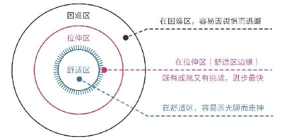
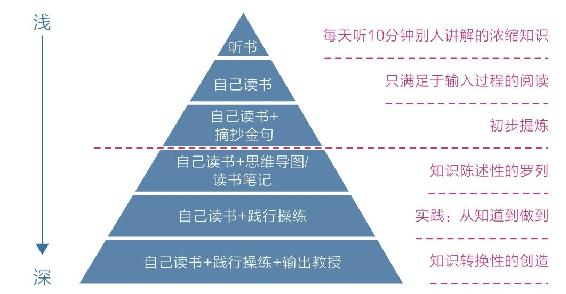
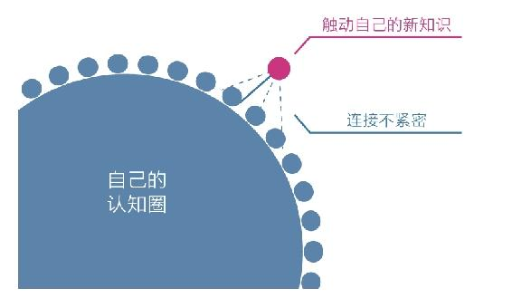
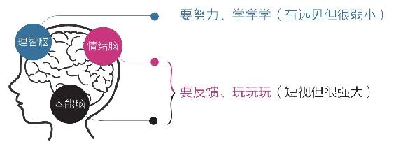
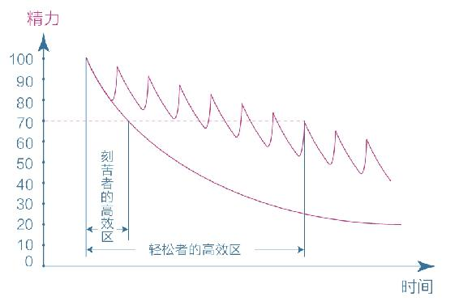
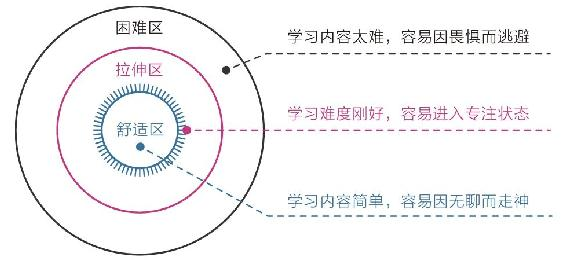
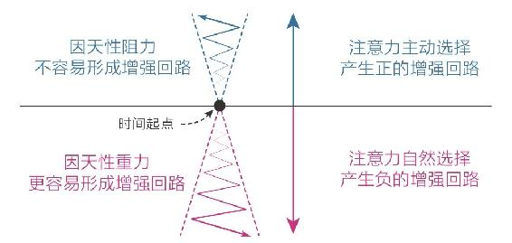
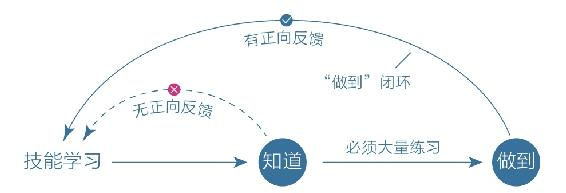
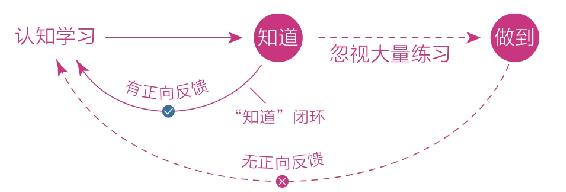
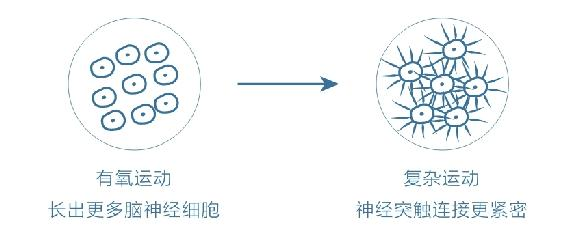

# 《认知觉醒：开启自我改变的原动力》

## 自序：开启自我改变的原动力

* **心智**——我们看待人和事的**态度**，以及由此做出的**判断**与**选择**
* **跳出成长的陷阱，刻意提升自己！**
* 每个人生来都是混沌无知的，人生观、价值观、世界观都是从零开始的，这种混沌和无知使自己看起来就像一个“**醒着的睡着的人**”。
    * 不断服从社会的规则，随波逐流
        * 没有多少压力，也没有多少动力
        * 总是沉溺于眼前的安逸，做着短视的选择
        * 对世界的运行规则浑然不知
            * 不知道事物的构成、框架
            * 不知道努力的路径、方法
            * 也不知道自己真正想要什么、能做什么、最后会成为什么样的人……
        * 迷迷糊糊到了某个年纪，发现自己对这个世界已经无能为力了
        * 在成长的过程中，遇到瓶颈
            * 想勤奋，却总是敌不过惰性；想努力，却总是陷入低效的状态；想精进，面前却总是弯路不断
            * 读了很多书，都忘了；付出很多努力，都白费了
            * 仿佛越使劲越困惑，越努力越迷茫
* 反思自己：
    * 如果意外发生在自己身上，如果现有的一切被“剥夺”，我还有什么、会什么，又曾在这个世界上留下了什么？
    * 要改变现状，不能再这样下去了
        * 让脑子变清晰，不再稀里糊涂
        * 掌握更多技能，不再遇事无计可施
        * 主动创造成就，不再被动承受现状……
* 探索自己：
    * **觉醒是什么？**
        * 每天有事情做不代表觉醒，每天都努力也不代表觉醒
        * 真正的觉醒是一种发自内心的渴望，立足长远，保持耐心，运用认知的力量与时间做朋友
    * **人与人的差异是认知能力上的差异**
        * 认知影响选择，选择改变命运
        * 成长的本质就是让大脑的认知变得更加清晰
        * 要广泛涉猎知识，看到自己成长的可能性，明白自己想要什么，了解世界的规律和真相，找到实现梦想的方法和路径

## 上篇：内观自己，摆脱焦虑

### 第一章 大脑——一切问题的起源

#### 第一节 大脑：重新认识你自己

* **三重大脑**
    1. **本能脑**——源于爬行动物时代，主管本能
    2. **情绪脑**——源于哺乳动物时代，主管情绪
    3. **理智脑**——源于灵长动物时代，主管认知

    
* **高低之分与权力之争**
    * 比起本能脑和情绪脑，理智脑实在是太弱小了
        * **出现年代**：本能脑（3.6亿年） > 情绪脑（2亿年） > 理智脑（250万年）

            
        * **发育成熟时间不同**：本能脑（婴儿时期） → 情绪脑（青春期） → 理智脑（成年早期）
        * **大脑结构特征**：
            * 人的大脑约有860亿个神经元，其中本能脑和情绪脑占了80%，所以对大脑掌控力最强
            * 本能脑、情绪脑离心脏更近，紧急情况下优先得到血液供应，理智脑反而缺血，所以会导致我们紧急情况下大脑一片空白。
        * **运行效率**：
            * 本能脑、情绪脑掌管潜意识和生理系统，运行速度极快；
            * 理智脑运行速度慢得多，且非常耗能。
    * 因为**理智脑对大脑的控制能力很弱**，所以我们在生活中做的大部分决策**往往源于本能和情绪，而非理智**
        * 本能脑、情绪脑——**目光短浅，即时满足** → 塑造了人的默认天性：**避难趋易、急于求成**
            * **避难趋易**——只做简单和舒适的事，喜欢在核心区域周边打转，待在舒适区内逃避真正的困难；
            * **急于求成**——凡事希望立即看到结果，对不能马上看到结果的事往往缺乏耐心，非常容易放弃。
        * 理智脑——**明明知道，但就是做不到；特别想要，但就是得不到**
            * 事实上理智脑很少有主见，**大多数时候我们以为自己在思考，其实都是在对自身的行为和欲望进行合理化**，这正是人类被称作“自我解释的动物”的原因。
* **成长就是克服天性的过程**
    * 人生来混沌，根本原因就是理智脑太过薄弱，无力摆脱本能脑和情绪脑的压制与掌控，**而觉醒和成长就是让理智脑尽快变强，以克服天性。**
    * 理智脑发达的人更能：
        * 立足长远，主动走出舒适区；
        * 为潜在的风险克制自己，为可能的收益延时满足；
        * 保持耐心，坚持做那些短期内看不到效果的“无用之事”；
        * 抵制诱惑，面对舒适和娱乐时，做出与其他人不同的选择……
    * **习惯之所以难以改变，就是因为它是自我巩固的——越用越强，越强越用。**
        * **要想从既有的习惯中跳出来，最好的方法不是依靠自制力，而是依靠知识**，因为单纯地依靠自制力是非常痛苦的事，但知识可以让我们轻松产生新的认知和选择。
    * 让理智脑更强大，不是要抹杀本能脑和情绪脑；它们三位一体，缺一不可。
        * 本能脑强大的运算能力和情绪脑强大的行动能能力，都是不可多得的宝贵资源
        * 让理智脑变强，不是为了对抗或取代本能脑和情绪脑
        * **理智脑不是直接干活的，而是用来驱动本能脑和情绪脑**

#### 第二节 焦虑：焦虑的根源

* **焦虑之战**
    * 无论个体还是群体，人类的安全感都源于自己在某一方面拥有的独特优势：或能力，或财富，或权力，或影响力。
* **直面焦虑**
    * 焦虑的几种形式：
        1. **完成焦虑**：每天活在截止日期面前，因为欲望涉及面广或者外在日程安排过金，难以做到深入和从容。
        2. **定位焦虑**：在零基础阶段直视某领域能人的所作物哦为，对自己的定位错误对标。
        3. **选择焦虑**：面对众多选择，摇摆不定，静不下心做最重要的事，或者不知道最重要的事情是什么；或者面对能人的观点感到纠结，无法作出决断。
        4. **环境焦虑**：受家庭、工作等外在环境的影响，有的事情不得不做，有的事情想做却不能做，在低效与无力中感到抓狂。
        5. **难度焦虑**：有的事情核心困难是无法回避的，不下决心与之死磕，始终在周围打转，时间越长越焦虑。
* **焦虑的根源**
    * 焦虑的原因：**想同时做很多事，又要立即看到效果**
        * **急于求成，想同时做很多事；避难趋易，想不怎么努力就立即看到效果。**
        * 焦虑是天性，是人类的默认状态。进入信息社会后，由于节奏变快竞争更强，这种焦虑被放大了。
    * 如何改变自己：**看清背后的机理并设法改变**
        * 克制欲望，不要让自己同时做很多事；
        * 面对现实，看清自己真实的能力水平；
        * 要事优先，想办法只做最重要的事情；
        * 接受环境，在局限中做力所能及的事；
        * 直面核心，狠狠逼自己一把去突破它。
    * **耐心**——人类最珍贵的品质
        * 直指我们急于求成、避难趋易的天性
        * **得耐心者得天下**

#### 第三节 耐心：得耐心者得天下

* **即时满足**——人类天性中最原始、最本能的部分
    * 现实生活中无论读书、考试，还是工作、赚钱，要想表现出色都必须经受长时间的磨炼
    * 要想有所成就，就必须克服即时满足的天性，**学会耐心**
* 很多人虽然嘴上说要保持耐心，但身体却诚实地游走在即时满足的边缘
* **缺乏耐心，是人类的天性**
    * **社会中的精英通常是那些能更好地克服天性的人，他们的耐心水平更高，延迟满足的能力更强。**
* 很多时候，我们对困难的事物缺乏耐心是因为看不到全局、不知道自己身在何处，所以总是拿着天性这把短视之尺到处衡量，以为做成一件事很简单。事实上，如果我们能了解一些事物发展的基本规律，改用理性这把客观之尺，则会极大地提升耐心。
    * **复利曲线**
        * 前期增长非常缓慢，但到达一个拐点后会飞速增长

            
    * **舒适区边缘**
        * 无论个体还是群体，其能力都以“**舒适区—拉伸区—困难区**”的形式分布
            * 要想让自己高效成长，必须让自己始终处于舒适区的边缘
            * 贸然跨到困难区会让自己受挫
            * 始终停留在舒适区会让自己停滞
        * 人类的天性正好与这个规律相反
            * 在欲望上急于求成，总想一口吃成个胖子，导致自己终日在困难区受挫
            * 在行动上避难趋易，总是停留在舒适区，导致自己在现实中总是一无所获
            * 如果我们学会在舒适区边缘努力，那么收获的效果和信心就会完全不同

            
    * **成长权重对比**
        * 对于学习而言，学习之后的思考、思考之后的行动、行动之后的改变更重要
        * 如果不盯住内层的改变量，那么在表层投入再多的学习量也会事倍功半
        * 从权重上看：**改变量﹥行动量﹥思考量﹥学习量**

            
        * 很多人之所以痛苦焦虑，就是因为只盯着表层的学习量
            * 保持学习输入是简单的，而思考、行动和改变则相对困难
            * 我们会本能地**避难趋易**，不自觉地沉浸在表层的学习量中
            * 表层的学习量是最能直接看到效果的，而底层的改变却不怎么容易发生，所以急于求成的天性也会促使我们选择前者
        * **深入底层，盯住实际改变**，我们就能跳出盲目、焦虑、浮躁的怪圈
    * **平台期**
        * 学习进展和时间不是线性的关系，而是波浪式上升的曲线

            
        * 任何学习都是这样，刚开始时进步很快，然后会变慢，进入一个平台期
        * **不要放弃，面对挫折和失败要继续坚持，才能突破平台期**
* **耐心不是毅力带来的结果，而是具有长远目光的结果。**这也意味着我们需要**终身学习**。
    * 当我们知道的规律越多，就越能定位自己所处的阶段和位置、预估未来的结果，进而增强自己持续行动的耐心。毫无疑问，对外部世界的规律的认知能使我们耐心倍增。
* **怎样拥有耐心**
    * 首先，面对天性，放下心理包袱，坦然接纳自己
    * 其次，面对诱惑，学会延迟满足，变对抗为沟通
    * 最后，面对困难，主动改变视角，赋予行动意义
    * **最高级的方法：请本能脑和情绪脑出动来解决困难**

### 第二章 潜意识——生命留给我们的彩蛋

#### 第一节 模糊：人生是一场消除模糊的比赛

* 机器人与人最大的区别——机器人没有潜意识
* 为了更好地生存，进化之手巧妙地采用了**意识分层**的手段，它让潜意识负责生理系统，让意识负责社会系统，如此分工，意识便得到了解放，可以全力投入高级的社会活动
    * 意识分层是一把双刃剑，在给人类带来巨大好处的同时，也带来了副作用——**模糊**。
    * 因为处理各种信息的速度不对等，意识很难介入潜意识，而潜意识却能轻易左右意识，所以人们总是做着自己不理解的事。这种模糊让人心生迷茫和恐惧，而迷茫和恐惧又使我们的认知、情绪和行动遭遇各种困扰，继而影响人生的走向。
    * 模糊，正是人生困扰之源；人生也是消除模糊的比赛。
* **学习知识，消除认知模糊**
    * 掌握的工具越多，认知能力越强，消除模糊的能力就越强。
    * 不幸的是，人类天生不喜欢学习和思考，因为这类事极其耗能；而潜意识没有思维，只有本能，会让身体走低能耗路线，诱导我们娱乐、享受，**所以本能通常都是阻碍学习的，而人若不学习，又无力克服本能。** 这个怪圈使我们在人生的初始阶段必然陷入混沌，若非外力压迫或牵引，我们往往很难跳出。
    * 时代的发展为我们提供了更多的学习机会和更好的学习环境，我们主动进入反本能成长的可能性也越来越大。有意思的是，**学习知识的目的是“消除模糊”，而获取知识的方法也是“消除模糊”，目的和方法相统一**，这几乎成了这个世界上所有能人共同遵守的学习法则。
    * **提升思考能力的方法正是不断明确核心困难和心得感悟，并专注于此。**
        * 现实中，很少有人能清醒地意识到这一点。人们总是习惯在模糊区打转，在舒适区兜圈，重复做已经掌握的事情，对真正的困难视而不见，这背后都是潜意识在操控——因为基因认为这样做耗能更低。
        * 优秀的人更倾向于做高耗能的事——消除模糊，制造清晰。
* **拆解烦恼，消除情绪模糊**
    * 认知模糊来自内部，而情绪模糊来自外界。
        * 人们每天都会面临各种烦恼，但多数人习惯被动承受，少有人乐于主动面对。
        * 虽然被动地承受痛苦也会耗费很多能量，但在基因的影响下，人就是不喜欢主动耗能。多数人为了逃避思考，愿意做任何事情。
    * 回避痛苦并不会使痛苦消失，反而会使其转入潜意识，变成模糊的感觉。**而具体事件一旦变模糊，其边界就会无限扩大，原本并不困难的小事，也会在模糊的潜意识里变得难以解决。**
        * 真正的困难总比想象的要小很多。人们拖延、纠结、畏惧、害怕的根本原因往往不是事情本身有多难，而是内心的想法变得模糊。
    * 任何痛苦事件都不会自动消失，哪怕再小的事情也是如此。**要想不受其困扰，唯一的办法就是正视它、看清它、拆解它、化解它，不给它进入潜意识的机会，不给它变模糊的机会；即使已经进入潜意识，也要想办法将它挖出来。**
    * **恐惧就是一个欺软怕硬的货色，你躲避它，它就张牙舞爪，你正视它，它就原形毕露。**
* **里清外明，消除行动模糊**
    * **行动力不足的真正原因，是选择模糊**。
    * **选择模糊**，就是我们在面对众多可能性时无法做出清晰、明确的选择。
        * 这样的情况很常见，比如当你心中有很多欲望、脑中有很多头绪，或者拥有可自由支配的时间时，你就会进入“既想做这个，又想做那个；既可以做这个，又可以做那个”的状态，就像自己始终站在十字路口，却不知道该往哪里去，从而使自己陷入一种不确定性之中。
    * **人类面对不确定性时，会不自觉逃避。当我们没有足够清晰的指令或者目标时，就很容易选择享乐，放弃那些本该坚持但比较烧脑的选项。**
    * 要想让自己更胜一筹，就必须学会花费更多的脑力和心力去思考**如何拥有足够清晰的目标**。我们要把目标和过程细化、具体化，**在诸多可能性中建立一条单行通道，让自己始终处于“没得选”的状态。**

#### 第二节　感性：顶级的成长竟然是“凭感觉”

* **潜意识的智慧**
    * 潜意识的特点：
        * 潜意识没有思维，只关心眼前的事物，喜欢即刻、确定、简单、舒适——**天性的部分**
        * 潜意识处理信息速度极快，能极其敏锐地感觉到很多不易察觉的信息——**感性的部分**
    * **“凭感觉”——察觉潜意识发出的信息**
* **凭感觉学习**
    * 高手学习的方法：**先用感性能力帮助自己选择，再用理性能力帮助自己思考。**
    * 理性、感性、天性的选择倾向：

        
* **凭感觉寻找人生目标**
    * 感性的力量适用于生活的方方面面，尤其在面临重大的人生问题时，如选择伴侣、确定职业、寻找人生目标等。
    * 一个人若是没有人生目标，纵然每天有吃、有喝、有书读、有班上，也会像一个迷失的人一样，内心没有喜悦、生活没有激情，甚至会厌恶自己，因为**目标是存放我们热情和精力的地方**。
        * 很多人会把自己的人生目标定位为“变得很有钱”或“被别人崇拜”，这样的目标不能说有错，但**往往不能长久，也无法给人真正的动力**，因为这是**理性思考和权衡利弊后的结果**，其动机往往来自“自我索取和外在评价”，**时间一长，很容易让人迷失方向，使动力枯竭。**
    * 真正的觉醒者往往会有意无意地**用感知力来代替思考力**。
    * **理性思维虽然很高级，但在判断与选择方面可能并不具有优势，它那蹩脚的性能实在无法与灵敏快速的感性媲美。所以，先用感性选择，再用理性思考，或许是一个更好的策略，尤其是在做那些重大选择时。**
* **如何捕捉感性**
    1. **“最”字法**：关注罪出动自己的点，并深入分析挖掘，往往会有丰厚的收获。
    2. **“总”字法**：审视并去消除不自觉重复跳出来的某些念头，或者心中总是挥之不去的事，让自己变得更加平和。
    3. **无意识的第一反应**：关注自己脑海中出现的第一个想法，这往往是来自潜意识的真实信息。
    4. **梦境**：是潜意识传递信息的一种方式，可能是内心真实想法的展示，也可能是灵感的启发。
    5. **身体**：无论生理还是心理上的不适，都会通过身体如实地反映出来，需要我们多去关注。
    6. **直觉**：给一些来路不明、无法解释的信息开绿灯。

### 第三章 元认知——人类的终极能力

#### 第一节 元认知：成长慢，是因为你不会“飞”

* **万物之灵”的根源**
    * 元认知，就是最高级别的认知，**它能对自身的“思考过程”进行认知和理解**。

        
    * 人类的大脑进化出了新皮层，这使我们具备了**极强的感知和思考能力**，从而可以**依靠理智生活**，而其他动物则只能依靠本能和情绪来生存。更神奇的是，人类还可以**观察自己的思维活动**，找出其中不合理的地方，然后**改进优化，不断做出更好的选择**。
* **元认知能力的差异**
    * **被动元认知和主动元认知**
        * 普通人通常只会在遇到问题时被迫启用这个能力，比如遭遇指责、批评时，才不得已去反思纠正；处于顺境时，依旧会顺着本性生活。**而有些人即使在没有威胁的情况下也会尝试练习扇动翅膀，让自己不断进化，彻底远离危险。**
        * 从被动到主动，这是一个转折点。当一个人能主动开启第三视角、开始持续反观自己的思维和行为时，就意味着他真正开始觉醒了，他有了快速成长的可能。
* **元认知如何改变我们的命运**
    * **反观**，是元认知的起点。
        * **你能意识到自己在想什么，进而意识到这些想法是否明智，再进一步纠正那些不明智的想法，最终做出更好的选择。**
        * 缺乏自我观察意识的人只能无意识地顺着感觉和喜好行事，无论在生理上还是在精神上，都会不自觉地追求眼前的舒适和简单，觉察不到自己当前的思维和行为有什么不妥，直到碰壁。**而人生是由无数个选择组成的，不同选择的累加造就了不同的人生。**
    * 元认知一旦开启，变化就会马上发生。
        * 想象自己身边有一个“灵魂伴侣”，时刻伴随，指引着你。
            * 在你走神时，他会提醒你集中注意力，去做更重要的事；
            * 在你迷茫时，他会站在人生高处，帮你看清局势和格局；
            * 在你生气时，他会帮你梳理情绪，找到比生气更好的选择；
            * 在你无解时，他会深入底层规律，提示你应该抓住什么；
            * 在你懈怠时，他会站在人生的终点，警醒你现在应该做什么……
        * **高级的元认知**：时刻帮你从高处、深处、远处看待现在的自己，让自己保持清醒、不迷失，保持动力、不懈怠，保持平和、不冲动。

            
* **如何获取元认知能力**
    1. **需要从“过去”端获取，包括学习前人的智慧和反思自身的经历。** 拓宽全局视角（高度）、掌握更深的底层规律（深度），帮助我们做出更加正确的选择。
    2. **自身的经历更是一种独特的财富。** 反思复盘有什么经验可以获得、有什么教训可以吸取，帮助自己避免作出不够明智的选择。
    3. **启用你的灵魂伴侣。** 让灵魂伴侣时刻监控你，让你审视自己的行为，把注意力防盗原来的目标上，去聚焦、去成长。
    4. **冥想。** 监控自己的注意力，集中到自己需要关注的地方。

#### 第二节 自控力：我们生而为人就是为了成为思维舵手

* **元认知能力就是觉察力和自控力的组合**
    * 元认知能力可以被重新定义为：**自我审视、主动控制，防止被潜意识左右的能力。**
* **我们天然被潜意识左右**
    * 很多人为了获得美好的人生，常常给自己立下早起、跑步、阅读、写作等目标，但是没过几天就放弃了，因为那些目标大多是受大环境影响而跟风设定的——别人说好，自己也想要，但实际上，自己并不需要。**仔细想想就会发现，这仍然是我们的第一反应，是潜意识在左右我们，我们并没有真正进行自我审视和主动控制。**
    * 从当下，到每天，再到一生，我们都天然被潜意识左右着。
* **成长就是为了主动控制**
    * 理智脑的战斗力表现在两方面：
        * 一方面是侧重学习、理解、记忆、运算的**认知能力**，即我们在校学习时主要锻炼的部分
        * 另一方面则是侧重观察、反思、判断、选择的**元认知能力**

        
    * 遗憾的是，我们大多数人虽然在学校集中锻炼了认知能力，但对元认知能力的锻炼却很少涉及。这也是很多人活了几十岁依然执行力不强、专注力不够、意志力不足的原因。所以，一个人要想掌握命运之船的风帆，就必须**主动、刻意地锻炼自己的元认知能力**，**让理智脑更多地参与大脑的决策**，掌握大脑的**主导权**，这样，我们就会比一般人走得更快、更远。
        * **主导权易手**的过程中，一个人会表现出的明显特征是：**能够主动控制注意力，不会被随机、有趣的娱乐信息随意支配。**
        * **每当遇到需要选择的情况时，我们要是能先停留几秒思考一下，就有可能激活自己的理智脑，启用元认知来审视当前的思维，然后做出不一样的选择。**
    * 种种迹象表明，那些有影响力的杰出人士与普通人的差距普遍体现在元认知领域，前者总是能在大大小小的选择关口上，展现摆脱潜意识支配的能力，从而尽可能地观察与思考身处的环境、自己的行为、与他人的关系等，给出有理有据的见解，做出更好的选择。
        * 真正的竞争力不在于学习能力，而在于强大的元认知能力。
        * 我们要想办法**锻炼自己的元认知**，就像锻炼我们的肌肉一样，只要经常锻炼，它们就会越来越强，能被轻易激活。
        * **一定要在选择节点上多花“元时间”。**
* **成为自己人生的思维舵手**
    * 有的时间权重要远远大于其他时间，称为**元时间**。
        * **所有面临选择的时间节点，都可以被称作“元时间”，比如一件事情、一个阶段或一天开始或结束时。** 善用这些时间会极大程度地优化后续时间的质量。
        * 我们不能在这个时候丧失主动权，任由本能左右自己进入下一个阶段，尤其是在面对诱惑或困难的时候。
        * “元时间”内我们就做一件事：**想清楚**。
            * **在选择的节点审视自己的第一反应，并产生清晰明确的主张。**
            * 元认知能力强的一个突出表现是：**对模糊零容忍**。
                * 想尽一切办法让自己找出那个最重要的、唯一的选项，让自己在某一个时间段里只有一条路可以走。
                * 犹豫不决，什么都想做又什么都做不好，才是最大的损失。
                * **自己行动力弱的时候，脑子里对未来的具体行动肯定是模糊不清的。**在这个时候，最好的自救方法就是**把所有想做的事情都列出来，进行排序，找出最重要的那件事，让脑子清醒。**
                    * **模糊，不仅需要在这些小事上消除，在选择人生目标等大事上也是如此。**
                    * 现实生活中，我们总是想都不想就一头扎进具体事情里，对什么事情更重要、什么事情最重要、做这件事对自己到底意味着什么等长远意义却极不清楚。
                    * **焦虑的人很少有“元时间”的意识，他们习惯不动脑子、直接行动，喜欢用饱和的行动来感动自己，想与做的时间配比差距悬殊，他们甚至连一丁点儿深入思考的时间都不愿意花，任由本能欲望让自己迷失在自我满足的行动里。**
    * **成为思维舵手的三种方法：**
        1. 针对当下的时间，**保持觉知，审视第一反应，产生明确的主张**；
        2. 针对全天的日程，**保持清醒，时刻明确下一步要做的事情**；
        3. 针对长远的目标，**保持思考，想清楚长远意义和内在动机**。
    * 元认知能力强的人就是这样：**无论是当下的注意力、当天的日程安排，还是长期的人生目标，他们都力求想清楚意义、进行自我审视和主动控制，而不是随波逐流。**
        * 元认知能力强的人时刻掌握方向舵，主动控制生命之船的航向；元认知能力弱的人只会当忙碌的水手，船漂到哪里算哪里。
        * 每克制自己一次，就相当于进行了一次自我审视和主动控制，相当于进行了一次锻炼。

## 下篇 外观世界，借力前行

### 第四章 专注力——情绪和智慧的交叉地带

#### 第一节 情绪专注：一招提振你的注意力

* 身体做着A，脑子却想着B
    * 这种场景司空见惯，俗称分心、开小差
    * 你可能根本不觉得这是个问题，甚至为自己能够一心二用而沾沾自喜
    * 然而这种行为却实实在在影响着我们——**它正是我们烦恼和无能的来源**
* **“行动”如躯体，“感受”如灵魂**
    * 我们的注意力其实都可以分为“**集中在行动上的**”和“**集中在感受上的**”两部分。
        * 我们会在做一件事情时全身心地感受这件事情，将注意力全部放在和当前事物相关的事情上
        * 随着行动越来越熟练，**我们在行动上集中的注意力越来越少，分散在其他地方的注意力越来越多**，于是我们不再去耐心感受行动。从此，**分心代替专注，身心开始分离**。

            
        * 就身心分离模式来说，身体上的影响实属小事，**真正严重的是它会对我们的情绪状态和能力提升产生持续的负面影响。**
* **分心走神的原因与危害**
    * 分心走神的原因：
        1. 觉得当下太无聊，所以追求更有意思的事情
        2. 觉得当下太痛苦，所以追求更舒适的事情
    * **分心走神的成本太低**，而人的天性又是**急于求成和避难趋易的**，所以在默认情况下，**我们都会不自觉地待在精神舒适区内**。
    * **“走神一时爽”，事后我们就得承担走神带来的各种损失**，其中**最大的损失莫过于生命质量变差**。
        * 因为走神时，我们要么沉浸过去，要么担忧将来，要么幻想不可能实现的情况，**走神可以让我们活在任何时候，唯独不能让我们活在当下**。
        * 生命是由当下的一个个片段组成的，**身心合一的片段组成的就是幸福专注的高质量人生，身心分离的片段组成的就是分心走神的低质量人生**。分心走神还会造成**拖延和低效**，因为情绪总是滞后于行为，所以人们做事时**进入状态往往很慢，需要情绪过渡**。
    * **分心走神的本质是逃避**，所以，面对困难时，身心分离的人总会不自觉地退回舒适区，而**身心合一的人则更容易跳出舒适区，直面困难**。
    * **从长远看，一个人专注力的高低可能预示了他今后成就的大小。**
    * 分心走神原本就是我们的天性之一，这与大脑的记忆机制有关。
        * 人类的大脑使用**背景关联记忆**的方法，即借助事情的背景或线索等提示信息来让我们想起特定内容。
        * 背景关联记忆的方式可以极大地降低大脑能耗，弥补大脑神经元处理速度的不足。
        * 进化是把双刃剑，背景关联记忆的一个副作用就是：我们感观所听到、看到、摸到、尝到、嗅到的任何信息，都会引出一些其他记忆内容，又因为感观受潜意识控制，而潜意识永不消失，**所以只要我们醒着，这种分心走神随时都可能发生**。**这也是我们需要锻炼元认知的原因，因为成长就是克服天性的过程，我们必须用觉知力和自控力去约束天性，否则就会被潜意识左右而不自知。**
* **收回感受，回归当下**
    * 如果一个人从小就养成了全情投入和界限清晰的专注习惯，那他不仅能获得智力上的聪慧，也能获得情绪上的平和，经过长期的强化就能与普通人形成巨大差距。
    * 绝大多数人意识不到注意力分为行动和感受两部分。如果我们能早点知道这个原理，并主动运用、修正，或许命运轨迹和生活质量都会有所不同。
    * 只要一招即可扭转局面：**让感受回归行动**。
        * **身体感受永远是进入当下状态的最好媒介，而感受事物消失的过程更是一种很好的专注力训练。** 它提示我们，**身心合一的要领不仅是专注于当下，更是享受当下**，而这种享受必将使我们更从容，不慌张。

#### 第二节 学习专注：深度沉浸是进化双刃剑的安全剑柄

* 人们因能感知太多信息而感到心神不宁，或因产生过多欲望而痛苦不堪，又或因担忧能力不足而滋生焦虑，无论顺境或是逆境都不得安生。
* **人类情绪和能力优劣的根本差异**
    * **主动选择信息**
        * 人类情绪和能力优劣的根本差异，来源于对自身关注方式的差异。
        * 能力弱者极易分心，容易受到外界干扰，把注意力从重要事情上分散开来；能力强者可以主动评比干扰，选择需要的信息并沉浸其中，拥有随时随地进入深度阅读和思考状态的能力。
    * **沉浸能力**
        * 因沉浸能力的不同，人类最终处在了不同的层次。
        * 从大范围看，沉浸能力强的人时常处于支配层，沉浸能力弱的人时常处于被支配层。
* **深度沉浸的方法**
    * 能聚焦的人很多，但卓越的人很少，其原因之一就是大多数人都缺乏深度沉浸的能力。
    * 天才 = 正确的方法 + 大量的练习
        * **“正确的方法”通常具有以下四个特征：**
            1. **有定义明确的目标**
                * 目标定义越明确，注意力的感知精度就会越高，精力越集中，技能越精进。
                * 如果目标太大，那就将它分解成小目标，这样做也是为了使目标更具体、精细。
            2. **练习时极度专注**
                * 极度专注不仅是学习的关键，也是灵感的来源。
                * 大脑在学习的时候有两种模式，一种是“意识”的专注模式，另一种是“潜意识”的发散模式。

                    
                * 变聪明的秘诀：先保持极度专注，想不出答案时再将注意力转换到另一件与此毫不相干的事情上。即事前聚精会神，让意识极度投入；事后完全忘记，让意识彻底撒手。这样，灵感和答案就会大概率地出现。
                * 好的学习模式是，**在做A的时候彻底关注A，在做B的时候彻底关注B，A和B两件事情之间有非常清晰的界线**。如果在做A的时候想着B，在做B的时候又想着A，那么意识工作的深度不够，潜意识也无法顺利开启，**这种边界不清的习惯对能力提升伤害很大**。
            3. **能获得有效的反馈**
                * 我们需要反馈来准确识别自己还存在哪些不足，以及为什么会存在这些不足。
                * 想方设法得到及时、有效的指导和反馈是不断精进的重要条件。
                * 如果条件有限，反馈也可以通过书籍影像、与他人交流或者自我反思来获取。
            4. **始终在拉伸区练习**
                * 一味重复已经掌握的事情是没有意义的，但挑战太难的任务也会让自己感到挫败，二者都无法使人进入沉浸状态，好的状态应该介于二者之间。
                * 当人们对当前的活动感到厌倦时，应当提升难度；当人们对当前的活动感到焦虑时，应该保持这个水平专注练习，如此反复交替就可以让自己进入心流通道，沉浸其中。

                    
                * 因为喜欢一件事而沉醉其中，这是可遇不可求的自发状态；**但是若想在某种方面有所成就，就必须建立稳固可靠的行为模式**。
                * 也就是说，我们每天都要做那些让自己**感到有些困难但又可以通过努力来完成的事情**，即**跳出舒适区，避开困难区，处在拉伸区**。

            
        * **真正的卓越离不开另一个要素：大量的练习**
            * 天才也需要大量的练习，或者说正是“正确的方法”加“大量的练习”造就了天才。
    * 审视自己：
        * 审视自己的注意力——是被动吸引还是主动选择？
        * 审视自己的沉浸度——是分心走神还是极度专注？
        * 审视自己的练习量——是浅尝辄止还是大量投入？
* 在前人的智慧中，用心拾取，走向卓越，成就自己，造福他人。

### 第五章 学习力——学习不是一味地努力

#### 第一节 匹配：舒适区边缘，适用于万物的方法论

* **好的成长是始终游走在“舒适区边缘”**
    * 找一个自己能坚持做下去的方式，比单纯按照标准化的时间和方式做更重要
    * **主动降低学习强度和难度，使自己处在最佳承受范围**，既保留了学习的成就感，也保证了学习的挑战性
        * 这种做法是**反直觉的**，因为我们想要做成一件事的时候，**通常会告诉自己要很努力、很拼，给自己设定一个很高的标准，给自己“打鸡血”，告诉自己坚持就是胜利**——这是我们**默认的思考模式**，但是**默认的不代表是科学的**。
    * 最佳的学习区域在**拉伸区内、舒适区边缘**，我们既有成就又有挑战，进步最快。
        * 我们应该花大量的时间去梳理哪些内容处在自己的拉伸区，即梳理那些“**会做但特别容易错或不会做但稍微努力就能懂**”的内容，然后在这个区域内努力。
* **距离太远的，我们都把握不住**
    * **距离我们太远的事物，我们通常无法把握，无论它们是令人痛苦的还是令人享受的。**
    * 在没有约束的生活中，虽然开始会很舒服，但随之而来的是我们会迷失在众多选项中。**做选择是一件极为耗能的事情**，如果没有与之匹配的清醒和定力，绝大多数人都会被强大的天性支配，去选择娱乐消遣。在有约束的条件下，我们反而效率更高，生活更充实。
    * 什么是底层概念、底层规律？**能解释的现象越多，这个概念就越底层。**
    * 只要让自己在**舒适区的边缘持续练习**，我们的**舒适区就会不断扩大，拉伸区不断扩展**，原先的困难区也会慢慢变成拉伸区，甚至变成舒适区，所以**成长是必然的**。
    * **速成是不可能的。** 因为能力圈只能一点一点扩大，所以只要我们遵循匹配规律，不断在舒适区边缘拓展自己，同时愿意和时间做朋友，那么我们注定可以持续成长，重塑自己。
* **一切为了匹配**
    * 我们行动一筹莫展的原因：这个问题**太大、太模糊**
        * 解决方法：**拆解目标**
            * 把大目标拆解为小目标，把任务从困难区转移到拉伸区
            * **几乎所有的行动达人都是拆解任务的高手**
            * 从舒适区到拉伸区的策略：**提炼目标**
                * **在拉伸区练习的一大特点就是要有关注点。** 关注点越多、越细致，我们的注意力就越集中，提升的效果就越明显。
                * **目标清晰了之后，“极度专注”也自然能做到了**，然后要不断通过反馈优化自己的关注点和小目标。
    * 只要站在舒适区边缘，一点一点往外走，同时和时间做朋友，你肯定会在不经意间发生蜕变。

#### 第二节 深度：深度学习，人生为数不多的好出路

* 科技和信息虽然在我们这一代发生了巨大的发展，但人类的学习机制并未随之快速变化，我们大脑的运作模式几乎和几百年前一样。更坏的消息是，**丰富的信息和多元的方式带来便捷的同时，也深深地损耗着人们深度学习的能力，并且这种倾向越来越明显**。
* **何为深度学习**
    * 人的学习分为**被动学习**和**主动学习**
        * **被动学习**：如听讲、阅读、视听、演示，这些活动对学习内容的平均留存率为5%、10%、20%和30%
        * **主动学习**：如通过讨论、实践、教授给他人，将被动学习的内容留存率提升到50%、75%和90%

        

    * 以**阅读**为例，从浅到深分别为：
        1. 听书
        2. 自己读书
        3. 自己读书 + 摘抄金句
        4. 自己读书 + 思维导图/读书笔记
        5. 自己读书 + 践行操练
        6. 自己读书 + 践行操练 + 输出教授

        
    * **“缝接”是深度学习的关键**，而大多数人只完成了“获取知识”，却忽略了“缝接知识”这一步，因此，他们的学习过程是不完整的。有些人做了一定的缝接，但缝接得不够深入，没有高质量的产出，也使学习深度大打折扣。
        * 浅层学习满足输入，深度学习注重输出。
        * **所以，逼迫自己获取高质量的知识以及深度缝接新知识，再用自己的语言或文字教授他人，是为深度学习之道。**
* **如何深度学习**
    * **深度学习的三个步骤：**
        1. **获取高质量的知识**
        2. **深度缝接新知识**
        3. **输出成果区教授**
    * 放弃多学、快学带来的安全感，要耗费更多时间，面临更难的处境，甚至还会“备受煎熬”
        * 正确的行动往往是反天性的，让你觉得舒服和容易的事往往得不到好结果，而一开始你认为难受和困难的事才能让你真正产生收获。
        * **可以通过以下方法改进：**
            1. **尽可能获取并钻研一手知识**
            2. **尽可能用自己的画把所学的知识写出来**
            3. **反思生活**
* **深度学习的好处**
    * **深度学习让我们不再浮躁，能磨炼理智，还能带来诸多好处，比如跨界能力的提升**
        * 为什么一些人能够轻易跨界，因为他们已经通过深度学习拥有了某些才干，这些才干在其他领域也适用，所以他们只要花少许精力就能玩得转。
        * 反过来，如果你不具备某些才干，那么跨界到其他领域或者行业时就只能重新培养底层知识和技能，这就非常吃力了。
    * **深度学习让人产生更多灵感**
        * 只有在自己的领域探索得足够深入时，灵感才可能在潜意识的帮助下显现。
    * **深度学习让我们看到不同事物之间更多的关联，产生洞见**
        * 如果一个人在一些领域的积累足够多，那么纵使面对分散注意力的事物，也同样能调动高级认知，把它们与有益的思考关联起来，产生更深刻、更独特的见解。
        * **深度之下的广度才是有效的。**
* 为浅学习正名
    * 深度学习与浅学习其实并不冲突，浅学习也有其价值，关键是不要搞反它们的权重关系。
    * 我们可以把浅学习作为了解新信息的入口，但不能把成长的需求全部寄托于此，更合理的态度是：**专注于深度学习，同时对浅学习保持开放**。

#### 第三节 关联：高手的“暗箱”

* **无关联，不学习**
    * 赵周《这样读书就够了》提出读书的三个步骤：
        1. 用自己的语言重述信息，即找到触动自己的信息点；
        2. 描述自己的相关经验，即关联生活中的其他知识；
        3. 我的应用，即转化为行动，让自己切实改变。
    * 这既是有效阅读的三个步骤，也是深度学习的三个层次：
        1. 知道信息点
        2. 关联信息点
        3. 行动和改变
    * **知道信息点是最浅的层次，完整、深入的学习还包含关联和行动。** 然而很多人到了第一层就停止了，或是因为心理满足，或是因为根本不知道学习有这三个层次，于是常年遨游在知识的海洋中，始终无法进阶，这其中最根本的阻碍在于他们意识不到新学习的知识点是孤立的。不管这个新知识让人多警醒、使人多震撼，若是无法与已有的知识发生足够的关联，它存活不了太久。
    * 孤立的知识点，**只有建立关联，才能构建期自己稳固的知识体系**。
    * 人在不知不觉间被分成了两个群体：**绝大多数人习惯以孤立的思维看待事物，喜欢花大量时间收集和占有信息；而另一批先行者则更喜欢拨弄信息之间的关联，从而在不知不觉间变得聪明了起来。**

        
* **事不关己，不关联**
    * 我们不需要时时刻刻把自己的所见所闻关联起来，既不可能，也没必要。
    * 我们需要牢牢聚焦自己最迫切的需求，**要让一切与自己有关**。
        * **知识的获取不在于多少，而在于是否与自己有关联，以及这种关联有多充分。**
        * **还有一个更重要的隐蔽条件不能忽视：你需要明确的目标或强烈的需求。**
* **如何获取关联能力**
    * 几条实现路径：
        1. 首先，手中有锤子
        2. 其次，输入足够多
        3. 再次，保持好奇心
        4. 最后，常说一句话
* **一切在于主动**
    * 主动运用关联、传递关联，让它不再隐藏、不再模糊

#### 第四节 体系：建立个人认知体系其实很简单

* **知识与认知的区别**
    * **真正的知识不是你知道了它，而是能运用它帮助自己做出正确的判断和选择，解决实际问题。** 这一点正是“**学术知识体系**”和“**个人知识体系**”的重要区别。
        * **学术知识体系**——是确定的、通用的，可供所有人学习和参照的
        * **个人知识体系**——是主观的、因人而异的，他人的知识体系可能与自己的实际需求油茶比
    * **在个人成长领域，没有最优、最确定、最权威的认知体系，只有最适合我们当前状态的认知体系。**
* **只学让自己触动的**
    * 初学者迫切希望拥有自己的认知体系，是因为自己手中只有碎片化信息，难以整合以应对复杂的情况。在没有觉知的情况下，他们很容易把“学习知识”和“学习认知”混淆，用掌握学术知识的方法去对待别人的认知体系，所以不禁沉迷于全面掌握和全盘照搬他人的体系，甚至感觉如果没有完全掌握对方的认知体系，就有可能前功尽弃。所以有这种想法和担忧的人们**非常在意形式上的完整**。
    * 正确的读书、学习方法——**寻找触动点**
    * 人的能力是无法跳跃发展的，只能在现有基础上一点一点向外扩展，而**扩展的最佳区域就在舒适区边缘**。
        * 认知也是一种能力，同样遵循这个原理：处于认知圈边缘的知识与我们的实际需求贴合得最紧密，因此也更容易让我们产生触动，进而与现有的知识进行关联。而他人认知体系中的很多知识，纵使再有道理，如果距离我们的认知或需求太远，就相当于处在了学习的困难区。
        * 我们不需要全盘掌握他人的知识体系，只需要掌握那些最能触动自己、离自己需求最近的知识。

        

        

        
    * **搭建个人知识体系**
        * **体系的本质就是用独特的视角将一些零散的、独立的知识、概念或观点整合为应对这个世界的方法和技巧。**
        * 搭建个人认知体系的真相：**打碎各家的认知体系，只取其中最触动自己的点或块，然后将其拼接成自己的认知网络。**
        * 有了触动，学习的机会就来了！
* **触动是最好的筛选器**
    * **触动学习法**：通过情绪触动，识别与自身需求结合最紧密的内容，紧紧抓住这些内容，使自己处在舒适区边缘，高效学习、快速提升。
* **仅仅触动还不够**
    * **伪触动**——产生触动不意味着连接紧密，如果不及时强化，这种触动就又飞走了。

        
        * 为了留住它，让它成为自己体系的一部分，就得和它发生关系，产生连接。主要表现在以下三个方面：

            1. **用自己的语言重新解释新知识**，促使自己原有的知识体系对新知识做出反应
            2. **在需要的时候能够顺利提取知识**，提取不出来的就是伪触动
            3. **在生活中经常练习或使用这些知识**，实践是产生强关联的终极方法

            
    * 建立认知体系的本质：**在舒适区边缘，一点一点向外扩展**

#### 第五节 打卡：莫迷恋打卡，打卡打不出未来

* 打卡无疾而终的原因：**动机转移，动力扭曲。**
* **动机转移，动力扭曲**
    * 当参与排名时，人们的动机扭曲了：从主动成长变成了被动完成任务、与他人做比较——“**任务心态**”。
    * 随着事件的推移、热情的退却、学习成长难度的增大，人们不得不依靠更强的意志力去坚持。此时大脑会开启自我保护模式，给自己找借口——只要完成打卡，就代表任务已经完成。
        * 人们会为了完成打卡任务，而不自觉降低标准。
        * **坚持的动机从学习转移到了完成任务上，由内在需求转移到了外在形式上。**
        * 一些“中毒”更深的人，不仅学习动机转移了，学习目标也转移了，忘记了做某件事情的意义。
* **认知闭合，效能降低**
    * **认知闭合需求**——人们面对模糊的问题，想寻找确定的答案。
    * 扩展到行为上——**一件事若迟迟没有完成，心里就总是记挂，期盼着早点结束；此事一旦完成，做这件事的动机就会立即趋向于零。**
    * **这就是打卡心态的特性：学不到，假装一下；学到了，立即停止。**
* **任务心态，身心分裂**
    * 任务心态在某些领域是有用的，比如军事领域；但在个人成长方面或许并不可取。
    * 个体生命的本质意义就在于身心合一，去觉知真实的生命过程，这其中有禅意、有哲思，也有科学。**至少在学习时，身心合一、极度专注是极为重要的前提条件**，只有在这种状态下，人们才能从学习活动中收到**精细、强烈的正向反馈。** 然而**任务心态破坏了身心合一的状态，这种不良体验会加剧人们对学习活动的厌恶感，形成恶性循环**。
    * 破除任务心态的方法——**集中心力做好眼前的事**。
* **两个策略，轻松改变**
    * 两个策略：
        1. **用记录代替打卡**
            * 只做行动记录，不做打卡展示，以便看到自己的学习轨迹，便于每周复盘。
            * 只要专注于学习成长活动本身，体会其中的乐趣，就能保持强烈的学习动机，化被动学习为主动学习。
        2. **设下限，不设上限**
            * 定一个容易完成的下限，身心容易沉浸，不会顾虑什么时候才能完成任务。
            * 规避了任务闭合需求，只要自己觉得有意思就可以一直学下去，直至感到有些吃力。
            * 这也符合刻意练习的原则——让自己始终处于舒适区的边缘。
    * 保持动机其实比打卡更难，不过做难事必有所得，因为它更接近成功的要求。
    * 仅仅保持动机依然是不够的，想真正获得成功还要学会创造动机。

#### 第六节 反馈：是时候告诉你什么是真正的学习了

* **是否有及时、持续的正向反馈，正是产生学习效果差异的关键。**
* **无反馈，不学习**
    * 在学习过程中，很多人从来都没有考虑过要产出点什么，以换取反馈，通过另一种方式激励自己。
    * 本能脑和情绪脑虽然没有思维、短视愚笨，但是它们超强的欲望和情绪力量却是宝贵的行动力资源，如果让它们感受到学习的乐趣，就能同样展现出强大的行动力，让自己像沉迷娱乐一样沉迷于学习。
    * **所以科学的学习策略是产出作品、获取反馈，驱动本能脑和情绪脑去“玩玩玩”，而不是一味地努力坚持，让理智脑苦苦地去“学学学”。** 这看起来很违反直觉，但它确实成为优劣学习者之间无形的分水岭。

    
* **有作品意识才有未来**
    * 有了清晰而强烈的**作品意识**，人会迅速改变，更加重视输出和运用，更加倾心打磨作品，换取外界的反馈。
    * 通过输出的方式产生价值，反馈带给自己强烈的成就感和继续行动的欲望。
    * 想创造全新的学习动机，就得放弃一味打卡输入的做法，想办法直接运用或产出作品，获取反馈。因为没有反馈的学习不仅是痛苦的，而且十有八九会失败。
    * 找到自己的高价值区——让自己成为某个领域的头部——再借助头部效应的系统推力，从一个小头部不断地向大头部移动，实现跃迁。而抢占头部最好的途径莫过于持续打磨高价值的作品，凭借作品换取反馈。
* **痛苦也是一种反馈**
    * 很多年轻人都有这样的顾虑：万一自己分享后收到的是批评或嘲笑该怎么办？如果自信心受到打击，那岂不是更糟？
    * 想清楚以下三点，就不难迈出步子了：
        1. **首先，分享不是随意分享半成品，而是尽最大力气将作品打磨成自己当前能力范围内可完成的最好的样子。**
        2. **其次，制定分享策略，展示给那些能力不及你的人。**
        3. **最后，冷静客观地对待打击。**
    * **所有痛苦都是上天给我们的成长提示。** 如果你的心态足够开放，就会感激生活中的痛苦和挫折，毕竟没有什么是比这更直接的反馈。
* **被动学习如何获取反馈**
    * 反馈同样是被动学习的制胜法宝
    * 通过自我测试主动制造反馈
    * 让自己始终游走在学习的拉伸区，自然进步最快
* **愿你从此不再平庸**
    * 古典的跃迁理论：打磨作品—到达一个小山的头部—受到更多关注—移动到一个更大山头的头部—借助系统推力，实现人生跃迁。
    * **真正的学习成长不是“努力，努力再努力”，而是“反馈，反馈再反馈”。**

#### 第七节 休息：你没成功，可能是因为太刻苦了

* **主动休息的秘密**
    * **“刻意练习四要素”：定义明确的目标、极度的专注、有效的反馈、在拉伸区练习**
    * 有效学习的关键是保持极度专注，而非一味比拼毅力和耐心。不过，保持专注需要花费精力，而我们的精力是有限的。只要在困难的事情上消耗精力，我们的精力就会慢慢下降。
        * 刻苦者看似无比勤奋，可效果却越来越差，过程中感受到的多是痛苦而不是乐趣，精力消耗严重，以致一旦放松就完全不想再次投入，他们更容易沉溺于舒适的娱乐活动。

            
        * 反观那些轻松的学霸，他们学习时从不过度消耗自己，只要感到精力不足，就停下来主动休息，这反而使他们精力桶的水位得到快速回升。

            
        * 如果我们把精力水平高于70%的区域视为高效学习区，那么对比二者不难发现，轻松者比刻苦者的高效学习区要大得多。这足以说明“主动休息”的意义和优势，优势日积月累，一些人领先于另一些人就会成为必然。而领先的那些人居然还很轻松，这对崇尚刻苦的人来说，无疑是个让人惊愕的认知反转。

            
* **保持专注的危机**
    * 面对大量的信息干扰和大量的竞争压力，大多数人只会本能地告诉自己要刻苦、要努力，却很少有人能意识到，**更科学的模式应该是：极度专注 + 主动休息，如此反复**。
    * 保持专注并不能仅靠意志力约束，还要靠主动休息“回血”，只有精力充沛了，我们才能保持专注。
    * 靠意志力强撑又不够专注的人，已经将自己置身于精力的困难区，体验到的多是痛苦而非愉悦。
    * 太容易的内容会让人因无聊而走神，太困难的内容会让人因畏惧而逃避，所以选择做那些“跳一跳就能够得着”的学习或工作，是最容易进入专注状态的。

        

        
    * 面对困难，主动调整
        * 要么重新设定学习内容，调整为合适的难度
        * 要么将目标拆解为更具体的小目标，降低工作的难度
        * 总之，想办法把难度控制在拉伸区范围内就对了
        * 不管面对多么棘手的任务，只要我们愿意动脑筋，总能找到主动调整的空间
* **意志失控的根源**
    * 精力充沛时，人们对困难无所畏惧，面对诱惑也有更强的抵抗力；但精力不足时，我们不仅难以面对困难，也难以抵抗诱惑，**毕竟克服困难和抵制诱惑都需要消耗意志力**。
    * **所以，一个真正的自控高手，不是一个只知道冲刺的人，而是一个善于主动休息、保持平衡的人。** 这些人无论面对精力的消耗与恢复，还是面对情绪的波动与还原，都会刻意保持高位富足的状态，避免进入低位稀缺的境地。
* **能拯救你的“番茄”**
    * 极度专注的能力不是想有就有的，造就专注品质涉及一个人的生活环境、兴趣匹配、自身动力、学识背景、习惯积累等各种因素。
    * 缺少这些条件的普通大众，如何获取专注的能力呢？
        * 一个简单又通用的方法：**主动培养“极度专注+主动休息”的行为模式**
        * 辅助工具：**番茄工作法——极度专注、主动休息、循环往复。**
        * 只要开始了，就尽力保持专注，把无关的事情放在一边。

### 第六章 行动力——没有行动世界只是个概念

#### 第一节 清晰：一个观念，重构你的行动力

* 与天性对抗是没有出路的，自制力强不等于行动力强
* **珍稀每天的礼物**
    * 每天早上醒来，我们都会收到一份礼物——纯净的注意力
    * **增强回路**——最初的选择会影响行为自动增强的方向
        * 注意力的增强回路是正向的还是负向的，很大程度上取决于你最初的选择
        * 行动回路一旦增强，我们就会进入高效又充实的状态
        * 在回路起点做选择，消耗的自制力是最小的；如果等负的增强回路形成了，再想改变就难了
        * **在初始阶段，强迫自己先做重要的事情，一旦进入正向的增强回路，你便能拥有强大的行动力**——这正是增强自制力、提升行动力的秘密。这个秘密适用于所有人。

            

            
* **清晰力才是行动力**
    * 知道和做到相差十万八千里——根源就是**模糊**
    * **一切只知道大概，对提升行动力是很致命的**
    * 仅仅知道要事第一是不够的，我们还需要拥有另外一种能力：**清晰力，也就是把目标细化、具体化的能力**——行动力只有在清晰力的支撑下才能得到重构。
* **一招建立清晰力**
    * 清晰力的建立并不复杂，需要你把时间规划和要做的事情**写下来**
        * 只有真正做过的人才能体会到**写与不写，完全不同**。
        * 很多时候，**人与人之间的差距就体现在那一点行动上**。
        * 做规划的目的不是为了让自己严格地按计划执行，而是为了让自己“**心中有数**”。如果当天计划有变，这份预案可以让你在处理完临时任务后重回正轨，而不会在目标与时间都模糊的情况下选择娱乐消遣。

        
    * 一天24小时，在开始的时候多花点时间想清楚什么任务是最重要的，并提醒自己投身于此，这样，工作效率之高会超乎想象。
* **成长是个系统工程**
    * 行动力的提升不能单纯指望“要事第一”或是“提高清晰力”这样的单一方面，因为**成长是一个系统工程，必然是多要素共同作用的结果**。
    * 一个人若是缺少人生目标，那么一味追求行动力无异于缘木求鱼。
    * **从某种程度上说，有自己热爱的事，比行动力本身要重要得多**，因为一旦有了热情，你就会自带“**要事第一**”和“**提高清晰力**”等各种属性。所以除了清晰力，我们还需要拥有**寻找目标的感知力、掌控自由的匹配力、指导万物的元认知能力**，等等，把它们联系起来，才能从内心深处真正地提升自己。
* **一切源于“想清楚”**
    * 你陷入怠惰、懒散、空虚的情绪中动弹不得时，往往是因为**你的大脑处于模糊状态**。大脑要么不清楚自己想要什么；要么同时想做的事太多，无法确定最想实现的目标是什么；要么知道目标，但没想好具体要在什么时候以什么方式去实现。
    * 不管你处在什么状态下，只要拿出笔和纸，写下目标、写下时间，你的元认知能力就能迅速提升，你就会动力满满。**认知越清晰，行动越坚定。**
    * 聪明的思考者都知道“想清楚”才是一切的关键，**在“想清楚”这件事上，他们比任何人都愿意花时间**，而普通人似乎正好相反，喜欢一头扎进生活的细节洪流中，随波逐流，因为这样似乎毫不费力。于是**在普通人眼里是“知易行难”，而在聪明人眼里是“知难行易”**，这一点值得我们反思。

#### 第二节 “傻瓜”：这个世界会奖励那些不计得失的“傻瓜”

* **成长中的悖论**
    * **悖论1：想先看到结果在行动的人往往无法看到结果。**
        * 耍小聪明的人因为结果不明朗，担心付出没有回报，所以不愿行动，永远停留在原地。
        * 只要道理正确，就别在乎那些小聪明，带着不计得失的心态向前走，目标会越来越清晰。

            

            
        * 在行动前后，我们看待这个世界的视角是不同的：
            * **做成一件事情之前——二维的、扁平的**
            * **做成一件事情之后——三维的、立体的**
        * 在立体的世界里，处于高层次的人和处于低层次的人对同一个问题的态度往往有天壤之别。
            * 世界是有认知层次的，处在下一个认知层次的人往往看不到上一个认知层次的风景，因而只能用狭隘的视角来判断：这些东西虽然很有道理，但似乎看起来并没有什么用。
            * 人们无法证明一件没有发生过的事。想要打破这个悖论，只有让自己行动起来，将认知提升到更高的层次，才能做出不同的判断。
        * **当我们绞尽脑汁去想却仍然想不清楚的时候，就要依据前人的假设先行动起来**，只有这样，我们才能更接近目标的本质，才能想得更清楚。
        * **很多人总是希望先找到自己的人生目标再行动，事实上，如果不行动，我们可能永远也找不到自己的人生目标**，毕竟依靠低维度的认知和经历，我们很难看清自己真正想要什么。只有先依据前人的假设走到更高的层次，人生目标才可能慢慢浮现。
    * **悖论2：思考很重要，但光想不做，贻害无穷。**
        * 当自己从来没有主动做成过一件事情的时候，总会以为做成一件事很容易，于是生出很多不切实际的欲望和想法，而欲望越多，就越做不成事。

            
        * 只有当我们真正做成一件事之后，才会知道自己能做的事情其实很少，这样就不会想要那么多了，而欲望一少，焦虑消散，我们反而能更专心地做好手头的事情。
        * **凡事看结果。** 只有这样才能让你主动斩断幻想、专注一点、静心行动，踏踏实实用行动让自己一点一点变好。**现实结果才是最好的“评判师”。**
* **突破阈值**
    * 打破悖论的方法：**不计较得失，先行动起来**
    * 我们需要先审视自己的行动量，看它是否突破了发生改变的阈值
    * 我们要专注、要持续行动，直到突破阈值，这样才能看到更高层次的风景

    
* **做一个有理有据的“傻瓜”**
    * 聪明的“傻”——不是盲目和冲动，而是有原理、有依据的鉴定。
    * 行动力强，是因为自己赞同行动背后的原理、依据和意义，而不是别人说好，自己就盲目跟风。
    * **如果你觉得别人讲的道理有理有据，而自己暂时无法反驳，碰巧自己又非常想做这件事，那就相信他们说的是对的，然后笃定地行动。**
    * 在实践途中，你自然也要保持思考，**用行动反复验证他们的理论，不适则改、适则用**，直到自己真正做到为止。届时你不仅能做成那件事，还能探索出自己的理论，成为别人眼中的高手。

        
    * 即便只是践行一个小小的理论，坚定的人也会有更多收获。

#### 第三节：行动：“道理都懂，就是不做”怎么破解

* 有太多人想不通为什么自己懂得那么多道理，却依然过不好一生。
    * 有些人认为，自己现在不做，是因为还没找到最好的方法，等找到了最好的方法，一切就会变得不一样，于是在寻找、搜集道理的路上越走越远。他们总认为自己还没准备好，担心方法不是最优的，殊不知这样的等待、观望本身就没有效率可言。更使人困扰的是，道理知道得越多，行动力反而越弱，因为似乎总有更好的道理等着我们去发现。
    * “知多行少”就像是一个死结，越拉越紧，以至于眼看着自己成为“认知上的巨人、行动上的矮子”却不知如何是好。当他们看到同龄人，甚至是后辈通过扎实的行动功成名就时，那些懂得的道理就会一股脑地化为焦虑倾泻而出。懂的越多，焦虑越多，无力之下，索性就破罐子破摔了。
    * 很多人因为缺乏耐心、急于求成，总想跳过行动环节，寻求捷径，最后发现：**这才是走了弯路，真正的捷径正是那条看起来漫长且低效的行动之路。**
* **认知，其实是一种技能**
    * **学习任何一门技能，本质上都是大脑中的神经细胞在建立连接。** 通过大量的重复动作，大脑中两个或者多个原本并不关联的神经元受到反复刺激之后产生了强关联。
    * 在技能学习的路径中，仅仅“知道”是无法形成闭环的，只有经过大量的练习，让大脑相关的神经元形成强关联，反馈闭环才能经由“做到”这个节点得以形成。所有技能学习都遵循这个规律，技能需要大量练习，直到可以利用潜意识自动执行。

        
    * 当我们进行认知学习的时候，却会有一种天然的错觉，认为明白了一个道理就好像掌握了这项技能。我们的确能通过在大脑中推演一番来获取这个认知的正向反馈，这个正向反馈在当时是真实的，但是仅凭一次强烈的神经元刺激远远无法形成强关联，所以这种认知也是极不稳定的。而此时大脑已经接收到认知带来的正向反馈，认为自己已经掌握了、得到了，从而忽略或轻视后续大量的练习。

        
    * 因此，绝大多数人在认知学习的过程中都会不自觉地停留在“满足于拥有或知道”的阶段。道理再好，如果不去刻意练习，这些美好的认知就永远不会真正对自己产生影响。
    * 避难趋易是人类的天性，人类总会容易选择简单的事情、选择短的反馈回路。在缺少觉知的情况下，我们很难察觉这一点。
    * 我们把技能学习路径和认知学习路径合在一起，就能清楚地知道自己“知而不行”的原因了。

        
    * 好在我们可以觉醒。觉醒就意味着看清，意味着主动改变默认设置，并做出新的选择。从现在开始，**把认知当成技能，知道或想通一个道理时，不要高兴得太早，想想后面还要做大量的练习，这样就不浮躁了。**
* **一开始做不好很正常**
    * 很多人不愿意行动的另一个原因是：**在开始尝试的时候，总觉得自己做不好，看不到明显的效果，然后就放弃了**。这个观点看似合理，实际上非常可笑。**从大脑的学习机制推断，无论学习一项技能，还是养成一个习惯，背后都是相关神经元从少到多、从弱到强的关联过程。那么在一开始、在神经元关联很弱的情况下，做不好是正常的。**
    * **只要不断练习，神经元之间的关联必然会越来越强**，即使你感觉自己暂时在退步，也不要气馁，因为你可能进入了学习的平台期。
* **我们能做的其实很少**
    * 道理不可能很快实践，道理也不会轻松实践。
    * 我们真正能做的事情其实非常少。另一个不愿意行动的原因是：欲望太多。
    * 任何主动做成的事情都不容易，都是漫长的过程，不可能一蹴而就。
    * **不发生真正的改变的学习都是无效的学习。**
        * **当“改变”成了读书学习的最高标尺后，我们的学习量还有可能下降。**
        * **现实和理论都告诉我们：懂得百点不如改变一点。真正的成长不在于自己懂得了多少道理，而在于自己改变了多少。** 对成长来讲，**道理都是“空头支票”，改变才是“真金白银”**。当你凡事都以改变为标准时，你的成长路径会更加清晰。

### 第七章 情绪力——情绪是多角度看问题的智慧

#### 第一节 心智带宽：唯有富足，方能解忧

* **稀缺心态，让人变笨**
    * **心智带宽**，就是心智的容量，支撑着人的认知力、行动力和自控力
        * **心智带宽一旦降低，人就很容易丧失判断力，做出不明智的选择，或急于求成，做事缺乏耐心，难以抵挡享乐的诱惑。**
        * 贫穷的确会使人变笨，因为贫穷造成的稀缺俘获了人的注意力，进而降低了人的心智带宽。
        * 任何能制造压力的事情都会降低心智带宽，只要我们的注意力被某一个巨大的事物吸引，我们就有可能进入稀缺状态，进而降低心智带宽，做出不明智的行为。
* **急于求成，焦虑丛生**
    * **当一个人同时面临很多任务的时候，他的心智带宽就会降低，反而没有了行动力和自控力。** 有生活经验的人都会尽量克制自己的欲望，在做重要之事的同时主动安排娱乐活动，尽量保持日程的闲余——这种方法是科学的、智慧的。
    * **现代生活虽然缓解了生存压力，却又带来了自控上的压力。抵制诱惑和欲望无一不消耗我们的心智带宽**，而那些有着大把时间和金钱的人士，如果没有足够的心智带宽，也会让自己陷入无聊和空虚之中。
* **唯有心智富足，方能解忧**
    * **如何获取心智带宽？我们需要保持自我觉知**
        1. **保持环境觉知，理智选择。**
            * 运用高级元认知能力保持对环境的觉知。
            * 在主动觉知的状态下，人可以承受压力，集中心力做出理智的决定。
        2. **保持目标觉知，少即是多。**
            * 知道自己想要什么，才能免于盲目奔波，才能让自己从忙碌中解脱，才有时间使用心智带宽审视自己，把更多的精力集中到最重要的事情上去。
        3. **保持欲望觉知，审视决策。**
            * 脑子里存在大量任务和念头的时候，往往是我们行动力最弱的时候。
            * 保持对欲望的觉知，及时审视它们，是清理自己心智带宽的好办法。
            * 真正的行动力高手不是有能耐在同一时间做很多事的人，而是会想办法避免同时做很多事的人。
        4. **保持情绪觉知，谨慎决定。**
            * 不要在最兴奋的时候做决定，也不要在最愤怒的时候做决定，尤其是重大决定。
            * 同时我们也要及时关注平日里恐惧、担忧、紧张、害怕等各种小情绪，并及时将它们清理掉。
        5. **保持闲余觉知，自我设限。**
            * 适当的闲余是我们应对压力和意外的宝贵资源，但是过度的闲余会带来无谓的欲望和低效的状态。

#### 第二节 单一视角：你的坏情绪，源于视角单一

* **世界是多维的，而我们只有一双眼睛**
    * 在面对各种困境的时候，多角度看问题的能力往往是考验解决问题能力的关键，它不仅能帮助人们获取智慧、成就事业，还能帮助人们在生活中拓展格局、化解烦恼。只是很多人意识不到这一点，习惯用原始的单一视角对待所有问题。
    * **世界上任何一个人、任何一件物、任何一件事都是多维立体的。**
    * 但在现实生活中，我们总是以最方便和最习惯的视角去观察事物，而这样的视角仅仅是众多视角中的一个。
    * 从单一角度识人的人，往往比较单纯，也更容易受伤，本质上是因为他们缺乏多角度认知事物的意识。反观那些学识或修养高的人，他们表达观点时通常非常谨慎，常用“也许”“可能”等表述。这真不是他们故意谦虚，而是因为**懂的越多，看到的角度越多，就越知道用一句话或一个观点无法把事情描述清楚**。
    * 一个人的性格和脾气好不好，也取决于他多角度看问题的能力：视角单一的人容易固执、急躁和钻牛角尖，而视角多元的人则表现得更为智慧、平和与包容。
    * 世界是多维的，而我们只有一双眼睛。我们每一次的观察、表达和行动，都只能影响这个多维世界中的一个维度。明白了这点，我们就能理解这世上**没有什么神奇的招数能够解决所有的问题，我们接触到的观点、方法通常只适用于特定的角度或范围。**
* **成为一台更好的相机**
    * 相机的概念还有另一层含义——**相机本身的差别**
    * 如果我们有一台高级的相机，应该有“向下兼容”的意识，引导低层的事物不断升级；如果我们曾经有一台“落后的相机”，那么更应该体会和包容对方的立场。
    * 在“相机”这件事情上，我们一定要**保持觉知，要清醒地意识到自己的视角偏误，时刻做好向上升级、向下兼容的准备**。拥有这种心态，不仅我们自己能越来越完善，还能与其他人都合得来。
* **总有一个更好的视角**
    * 不要被原始视角束缚；主动转换视角可能会看到一个新天地。
    * 视角不同，选择也会不同。
    * **无论你当前处于何种情绪旋涡，只要自己愿意，总能找到更好的角度。只是有的人面对再好的事情时都盯着一点瑕疵不放，而有的人却能从任何一件糟糕的事情中找到闪光点并放大，忽视其他不足之处。**
* **大师修炼之路**
    * 如何拥有多视角能力，成为生活的“摄影大师”
        1. **勤移动**——多移动“相机”机位，从不同视角看问题
        2. **善学习**——多学习，借助高人的视角来观察世界
        3. **要开放**——情绪平和，不戴有色眼镜，不带主观色彩，先想办法了解事实
        4. **寻帮助**——寻找有效的外部视角，借助他人视角来克服自己单一思维的局限
        5. **多运动**——引导大脑从新的角度看事物，或者从不同角度观察问题
        6. **常反思**——每日反思，把心中的烦恼全部倒出来复盘

#### 第三节 游戏心态：幸福的人，总是在做另外一件事

* **幸福源自主动掌控**
    * 自我决定理论中人类的三种内在需求：**关系需求、能力需求和自主需求**

        
    * 自主需求，是自我决定理论的关键与核心。
    * 改变自己对事物的看法，就能改变自己的情绪。
    * 放眼现实生活，我们总是要面对很多“不想做但必须做”的事情。面对这些事情，我们会不自觉地感到沮丧、抗拒和排斥，因为这些都不是我们自己主动做出的选择，而是外界给的压力。**困难和压力总能把人的情绪和注意力抓得死死的，让你很难看到其他角度。**
    * 好消息是，这个世界比我们想象的要积极，我们以为自己没得选，其实还有很多角度可供选择，毕竟任何事物都是多维、立体的。
* **只是在做另外一件事**
    * 获取掌控权并不难，我们只需要默念一句咒语：**我并不是在做这件事，我只是在做另外一件事。**
    * 一旦你有了新的选择，就会意识到：**事情本身并不重要，我们只是在通过它获取另外一种乐趣，顺便把这件事给做了**。在心理学上，这个方法叫作“动机转移”。
    * 缺乏觉知的人，其行事动机通常都由外部事物牵引，少有自主选择和掌控的余地，容易陷入“为做而做”的境地。但有觉知的人会适时觉察自己的行事动机是否停留在与目标任务无关的外部事物上，如果是，他们就主动想办法将其转移到内部，以拥有自主选择和掌控的能力，而这种掌控的窍门基本上可以分为两类：**为自己而做**和**为玩而做**。
        * **为自己而做**，是指我们在做一件事情的时候，**把注意力集中在自己身上，而不是外界的评价上**。这样做的好处是，**我们可以更好地掌控自己的情绪，不会因为外界的评价而波动**。
        * **为玩而做**，把事情变得更好玩，让自己不再苦闷。
            * **为自己而做，通常是为了应对外部的压力和要求，为玩而做，则是为了应对重复、枯燥的事情。**
            * 如果想要玩得更尽兴，就把困难的大事情拆解成小块。当要做的事情小到自己可以轻松完成时，我们就会跃跃欲试。
* **这个世界的模样取决于我们看待它的角度**
    * 为自己而做可以解放情绪，为玩而做可以解放注意力。

### 第八章 早冥读写跑，人生五件套——成本最低的成长之道

#### 第一节 早起：无闹钟、不参团、不打卡，我是如何坚持早起的

* 认知上想通透了，行动时就不需要大把的意志力来支撑了。
* 早起可以高效地做这些事情：
    1. 规划
    2. 跑步
    3. 反思
    4. 读书或写作
    5. 困难的工作
* 早起的注意事项：
    1. 初期会有一个相对痛苦的适应期
    2. 循序渐进、难度匹配
    3. 按状态起床
    4. 中午需要午休一次
    5. 不打扰他人
    6. 提前准备
    7. 明确遇到哪些情况时可以不早起

#### 第二节 冥想：终有一天，你要解锁这条隐藏赛道

* **不可不知的7个小球**
    * 人的意识能同时梳理的信息量不多，平均为7±2个。
    * 人和人之间的能力竞争，说到底就是脑力资源利用率的竞争。
    * 大脑通过训练，可以借助恰当的方式让它们目标一致，这种训练方式就是**冥想**。
    * 科学研究表明，通过这种集中注意力的冥想练习，人大脑皮层表面积增大，大脑灰质变厚，这意味着这种练习可以从物理上让我们变得更加聪明，因为一个人大脑皮层表面积和大脑灰质厚度是影响人聪明程度的因素。
    * 我们平时学习各种技能，比如钢琴、游泳、体操等，都会提高相关脑区的神经元密度，促进脑细胞之间的信号沟通，但是这些练习一旦停止，神经元就会开始减少，而冥想带来的改变是持久的。
* **保持情绪平和，不过如此**
    * 大部分的小球很“轻”，很多事情都会让人的思绪脱离现实，很容易在脑海中幻想一些改变，这也是人类避难趋易天性的出口
    * 有的小球很“重”，来自巨大的压力，在大脑中挥之不去，会让人无心做事、郁郁寡欢
    * 一轻一重，很多人无法摆脱这两种情绪，为此苦恼不堪
    * **对于那些过轻的小球，保持专注就能给它们加码，让它们稳定下来；对于那些过重的小球，你冥想时必须正视它们、接纳它们，否则你无法做到专注。**
        * 把心中的困惑写出来，那些紧张、担忧、畏惧、害怕等情绪就会在清晰的观察下无处遁形，小球的重量自然会减轻。
        * 只要持续练习，脑中的小球就能保持最佳质量，既稳定，又可控，人们就能把注意力和情绪锁定在一个相对理想的状态下。

#### 第三节 阅读：如何让自己真正爱上阅读

* 人做决定的两个层次：**情绪决定**、**理智决定**
    * 习惯做“情绪决定”的人，凡事倾向于半途而废，而善于做“理智决定”的人则更容易让想法变成现实。
    * 读书是一件需要长期坚持的事情，如果我们只是凭借一时的兴趣去读书，那么很难坚持下去。
* **换个角度看阅读**
    * **想要快速成为一个行业的高手，最好的方法就是和行业专家交流，直接向他们请教。** 但是普通人很少有这样的机会，那么最好的办法就是读书。
    * 只要**选书得当**，就能**以极低的成本找到行业里顶级的思想**。
    * **读书就是用最低廉的成本获取最高级的成长策略**，这是所有人提升自己的最好途径。
    * **脚步不能丈量的地方，文字可以；眼睛无法看到的地方，文字可以**，文字还可以带我们穿越时空与千百年前的顶级思想家交流。时间和空间都不再成为束缚，这可是无法轻易拥有的能量，但阅读能够帮助我们获得。
    * **几乎所有的书籍都是智者看待事物、做选择、决策的过程。** 看多了之后，就能借助他们高明的视角来提升自己的选择能力。阅读改变命运，就是从改变我们的认知和选择开始的。
* **阅读，让人拥有高密度的思考**
    * **人与人的根本差异是认知能力的差异，认知能力极度依赖思考能力，思考能力是我们立足现代社会的根本竞争力。** 所以，目光长远的人都会主动、刻意地磨炼自己，**尽力提高每天的思考密度**。
    * 阅读可以**让我们的思维能随时与顶级的思想交锋，对一个主题进行深度全面的理解，并与自己的实际充分关联，这种思维状态在平淡生活中是很少有的，但是只要拿起书本就可以马上拥有**。我们每天花费在阅读上的时间越多，花在无意义的娱乐活动上的时间就会越少，思维密度就会越来越大。通过长年累月的积累，坚持高密度思考的人会与习惯低密度思考的人产生巨大的差距，这正是我们现在要仰望智者的原因。
* **阅读是一个技术活**
    * 为了避免低效的努力，要避免陷入以下误区：
        1. **读书要先学会选书，选书比读书更重要。**
            * 专注自己最迫切、最需要解决的问题
            * 阅读难度处在自己舒适区边缘的书
            * 在初读的时候，一定要让兴趣、难度、需求三者尽可能匹配
        2. **阅读是为了改变**
            * 阅读只是整个过程的开始，读完之后的思考、实践比读书本身更加重要。
            * 真正读好一本书，往往需要花费数倍于阅读的时间去思考和实践，并输出自己的东西——可能是一篇文章，也可能是养成一个习惯——这个过程比阅读本身要费力得多。
            * 从权重上看：**阅读量 < 思考量 < 行动量 < 改变量**
            * **只要紧紧盯住“改变”这个根本目标，很多阅读障碍就会立即消失。** 面对海量知识，我们不需要焦虑，要仅仅把握自己的需求来读书和吸收，让自己可以气定神闲地看着周围的一切。
        3. **高阶读书法**
            * 注意自己在阅读时产生的与自己掌握的其他知识的关联。
            * 读写不分家，通过阅读把自己所学的知识用自己的语言重新阐述，甚至教授给他人。这样知识就会在自己的脑中变得非常牢固。
    * 阅读是每个人都能获得的平等、希望和机会，如果你希望自己变得不同，那就请用一生的时间去探索、实践。

#### 第四节 写作：谢谢你，费曼先生

* **费曼先生和费曼技巧**
    * 无论学习什么东西，都要努力琢磨它们究竟在讲什么，它们的实际意义是什么，然后用自己的话将其重新讲出来。
    * **费曼技巧**——通过**自己的语言**，**用最简单的话把一件事情讲清楚**，最好让外行人也能听懂。
* **用简单的语言**
    * 我们的大脑里同时住着“**感性**”和“**理性**”两个小人，理性小人很高级，但感性小人更强大，所以**绝大多数时候，我们的行为都由感性主导，包括接收信息**。
        * 先用合适的故事引起对方“感性小人”的兴趣和注意，然后把想要表达的道理通过“感性小人”转达给“理性小人”，这是一个很好的策略，两个小人都会很满意。
    * **能用简单的语言就不要用复杂的，这就是费曼技巧的核心之一。** 不过，简单不仅仅意味着轻松，还意味着简洁和形象。
    * 类比不仅是文学中的修辞，更是我们的思维方式和认知工具。以一种事物认知另一种事物，通过已知事物来解释未知事物，恰恰是学习的本质。
* **用自己的语言**
    * **用自己的语言重新表达就是在调动自己的千军万马。**
    * 很多写作者并不重视这一点，以致长期停留在“**知识陈述**”层面，无法达到“**知识转换**”层面。比如一些人读完一本书之后，把全书的框架和观点罗列一番就认为完成写作输出了，这其实远远不够，顶多算是把别人的知识挪了个地方——你只是多了些“军马”，但并不能调动它们，这是无用的。
    * **一个人想要真正成长，一定要学会写作，因为“只读不写”的学习是不完整的，是低效的。而写作时如果不学会用自己的语言转述，则是无用的。**

#### 第五节 运动：灵魂想要走得远，身体必须在路上

* **好的事物往往是“正相关”的**
    * 时常运动的人，体内生态系统犹如一汪清泉，而久坐不动的人，体内生态系统则更像是一潭死水。
    * **运动能够使大脑长出更多的新的神经元，这意味着运动可以在物理上让人变得更“聪明”。**
    * 运动，正是人生幸福正相关因素的出发点。
* **好的模式是“运动 + 学习”**
    * 新生的神经元需要经过发育，长出神经轴突和树突，才能成为真正的神经细胞

        
    * **运动不是关键，运动之后的活动安排及环境刺激才是关键**
        * 有效的模式是：运动后1~2小时进行高强度、高难度的脑力活动，或者需要复杂技巧的体力活动，以及参加与以往不同的社交活动，这样可以让新的神经元受到刺激，不断成长，让自己变得更聪明。
        * 绝大多数运动者的硬伤——运动后缺乏主动学习的习惯，选择了那些无需动脑或者让自己感到很舒服的事，那些好不容易生长出来的神经元随即消散，他们因此错失了变“聪明”的机会。
* **如何正确地运动**
    * **让自己保持做有氧运动时有些气喘的状态**
    * 好的运动方式一定同时包括有氧运动和复杂运动

        
* **四肢发达，头脑更发达**
    * **运动更大的意义不在于健身而在于健脑**，它不仅能使人更加乐观，还能使头脑更加灵活，最终使健康水平和认知水平实现双重提升。

## 结语 一流的生活不是富有，而是觉知

* 记录日程，提高对时间的敏感度。
* 对当天最触动自己的事情或者感悟进行复盘。
    * 复盘的方式：
        1. 描述经过——以便日后回顾时能想起当时的场景
        2. 分析原因——多问几个为什么，直到有深度的启发
        3. 改进措施——尽可能提炼出一个认知点或行动点
* 打磨认知晶石，形成我们生活的印记和结晶，这样我们的生命质量和密度将远远超过那些不反思的人。
* 每日反思的三大底层原理：
    1. **触动学习法**——找到触动点，这是在舒适区边缘的成长感悟，这样成长是最快的
    2. **运用元认知**——元认知是人类的终极能力，我们要自我审视，找到思维的不足之处，启动理智脑，消除情绪的模糊地带
    3. **刻意练习**——带着清晰的目标去学习，带着明确的问题去练习进步，带着要领去生活，这样我们才能成长飞快。
* 反思的好处：
    1. **节省我们的生命**——抓住灵丹，记录下自己的想法，回头再整理打磨，把认知放大。
    2. **提高我们感知细节的能力**——越是好的反思，着眼点往往越细微；而细微的变化却不是每个人都能感受到的，这体现了反思者的水平。
    3. **让我们正视痛苦**——痛苦不是坏事，是上天给我们成长的信号与提示。
* **开始行动**
    * 行动的注意事项：
        1. **不要被形式所束缚**，形式完美不重要，改变才最重要
        2. **尽量提炼认知点或行动点**，指导未来的生活
        3. **列行动清单**，把最重要的行动单列出来
        4. **对自己极度坦诚**，把自己心底最真实的想法挖出来
        5. **多阅读**，与智者交流，增强自己的感知能力
        6. **选择合适的记录载体**，建议使用电子文档做笔记
* **过一流的生活**
    * 一个人觉醒的起点——**觉知**
    * 当一个人能够觉知到什么是好，什么是不好的时候，就必然会主动做出新的选择。

## 后记 共同改变，一起前行

* 如果这本书对你有所帮助，哪怕只有一个点触动并真实地改变了你，那它就完成了使命。
* **一个人若是学会了用知识和智慧驱动理性和感性这两种力量，就可以获得认知觉醒。**